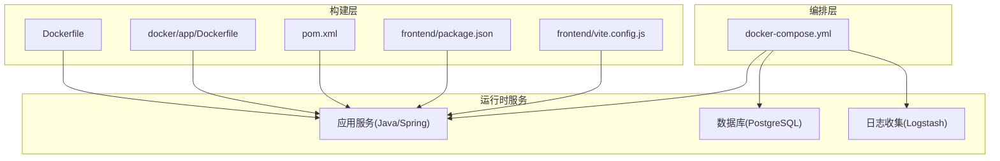
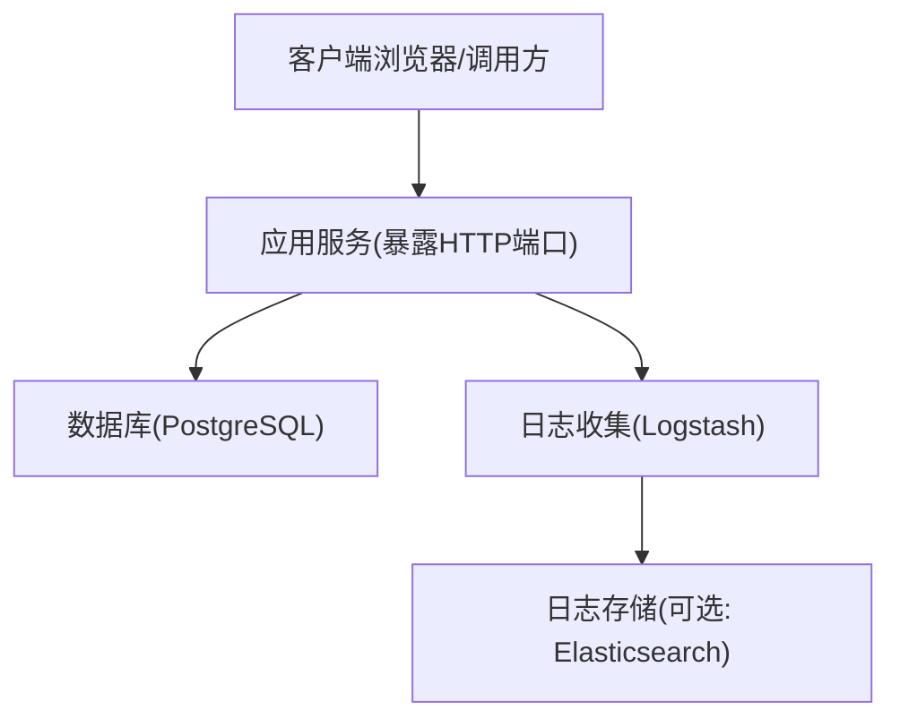
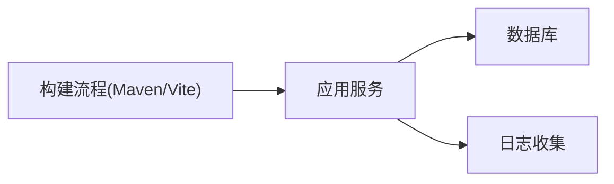

# Docker容器化部署

<cite>
**本文引用的文件**   
- [docker-compose.yml](file://docker-compose.yml)
- [Dockerfile](file://Dockerfile)
- [.dockerignore](file://.dockerignore)
- [pom.xml](file://pom.xml)
- [src/main/resources/application.yml](file://src/main/resources/application.yml)
- [src/main/resources/logback-spring.xml](file://src/main/resources/logback-spring.xml)
- [src/main/resources/schema-postgresql.sql](file://src/main/resources/schema-postgresql.sql)
- [src/main/resources/schema.sql](file://src/main/resources/schema.sql)
- [docker/app/Dockerfile](file://docker/app/Dockerfile)
- [docker/logstash/config/logstash.yml](file://docker/logstash/config/logstash.yml)
- [docker/logstash/pipeline/logstash.conf](file://docker/logstash/pipeline/logstash.conf)
- [frontend/package.json](file://frontend/package.json)
- [frontend/vite.config.js](file://frontend/vite.config.js)
</cite>

## 目录
1. [简介](#简介)
2. [项目结构](#项目结构)
3. [核心组件](#核心组件)
4. [架构总览](#架构总览)
5. [详细组件分析](#详细组件分析)
6. [依赖关系分析](#依赖关系分析)
7. [性能与资源限制](#性能与资源限制)
8. [监控与日志收集](#监控与日志收集)
9. [安全与最佳实践](#安全与最佳实践)
10. [故障排查与调试](#故障排查与调试)
11. [结论](#结论)

## 简介
本指南面向使用Docker进行容器化部署的读者，围绕应用服务、数据库、日志收集等容器的编排与优化展开。内容涵盖：
- 镜像构建过程与多阶段构建优化
- docker-compose服务编排（网络、数据卷、环境变量）
- 容器间通信与服务发现机制
- 资源限制与性能调优
- 监控与日志收集方案
- 安全性与最佳实践
- 故障排查与调试方法

## 项目结构
仓库包含后端Java应用、前端静态资源、Docker相关配置以及日志采集组件。关键目录与文件如下：
- 根级Dockerfile与docker-compose.yml用于整体编排与构建
- docker/app/Dockerfile为应用专用构建脚本
- docker/logstash用于日志收集管道
- src/main/resources下包含应用配置、日志配置与数据库初始化脚本
- frontend为前端工程，构建产物由后端打包或反向代理提供

图表来源
- [docker-compose.yml](file://docker-compose.yml)
- [Dockerfile](file://Dockerfile)
- [docker/app/Dockerfile](file://docker/app/Dockerfile)
- [pom.xml](file://pom.xml)
- [frontend/package.json](file://frontend/package.json)
- [frontend/vite.config.js](file://frontend/vite.config.js)

章节来源
- [docker-compose.yml](file://docker-compose.yml)
- [Dockerfile](file://Dockerfile)
- [docker/app/Dockerfile](file://docker/app/Dockerfile)
- [pom.xml](file://pom.xml)
- [frontend/package.json](file://frontend/package.json)
- [frontend/vite.config.js](file://frontend/vite.config.js)

## 核心组件
- 应用服务：基于Spring Boot的Java应用，提供REST API与静态页面托管能力。
- 数据库：PostgreSQL，持久化业务数据与对话/记忆等结构化信息。
- 日志收集：Logstash负责从应用容器收集日志并转发至下游（如Elasticsearch）。
- 前端：Vue/Vite构建的静态资源，可被后端静态目录托管或通过Nginx反向代理。

章节来源
- [src/main/resources/application.yml](file://src/main/resources/application.yml)
- [src/main/resources/logback-spring.xml](file://src/main/resources/logback-spring.xml)
- [src/main/resources/schema-postgresql.sql](file://src/main/resources/schema-postgresql.sql)
- [src/main/resources/schema.sql](file://src/main/resources/schema.sql)

## 架构总览
下图展示了容器化后的系统组成与交互关系：客户端通过网关访问应用服务；应用服务连接数据库读写数据；应用日志经Logstash统一收集。

图表来源
- [docker-compose.yml](file://docker-compose.yml)
- [docker/logstash/config/logstash.yml](file://docker/logstash/config/logstash.yml)
- [docker/logstash/pipeline/logstash.conf](file://docker/logstash/pipeline/logstash.conf)
- [src/main/resources/logback-spring.xml](file://src/main/resources/logback-spring.xml)

## 详细组件分析

### 镜像构建与多阶段优化
- 根级Dockerfile与docker/app/Dockerfile分别承担不同职责：前者可用于快速演示或单阶段构建，后者更适合生产环境的多阶段构建。
- 多阶段构建建议：
  - 构建阶段：安装JDK与Maven，拉取依赖，执行编译与测试，生成JAR包。
  - 运行阶段：仅引入最小运行时镜像（如JRE），拷贝JAR包，设置非root用户运行。
- 构建缓存优化：将依赖解析与源码分离，优先复制pom.xml以利用Docker层缓存。
- .dockerignore应排除node_modules、target、.git等无关文件，减小上下文体积。

章节来源
- [Dockerfile](file://Dockerfile)
- [docker/app/Dockerfile](file://docker/app/Dockerfile)
- [.dockerignore](file://.dockerignore)
- [pom.xml](file://pom.xml)

### 服务编排与网络/数据卷配置
- 服务定义：在docker-compose中定义应用、数据库、日志收集等服务，并通过depends_on控制启动顺序。
- 网络：默认bridge网络下，服务名即为主机名，实现服务发现；可通过自定义网络隔离不同环境。
- 数据卷：为数据库挂载持久化卷，避免重启丢失数据；应用日志输出到stdout/stderr以便外部收集。
- 环境变量：通过.env或compose中的environment注入数据库连接、密钥等敏感信息。
- 健康检查：为关键服务添加healthcheck，确保依赖就绪后再启动上游服务。

章节来源
- [docker-compose.yml](file://docker-compose.yml)

### 数据库初始化与迁移
- 首次启动时，PostgreSQL容器会执行schema初始化脚本，确保表结构与基础数据存在。
- 建议在应用侧也集成迁移工具（如Flyway/Liquibase），实现版本化与回滚能力。

章节来源
- [src/main/resources/schema-postgresql.sql](file://src/main/resources/schema-postgresql.sql)
- [src/main/resources/schema.sql](file://src/main/resources/schema.sql)

### 应用配置与日志输出
- application.yml集中管理数据库、第三方API、端口等配置，支持按环境覆盖。
- logback-spring.xml定义日志格式、级别与输出目标，推荐输出JSON到stdout，便于Logstash收集。

章节来源
- [src/main/resources/application.yml](file://src/main/resources/application.yml)
- [src/main/resources/logback-spring.xml](file://src/main/resources/logback-spring.xml)

### 前端构建与静态资源
- 前端使用Vite构建，package.json定义依赖与脚本，vite.config.js配置构建行为。
- 可将dist目录复制到后端静态目录，由应用直接托管；或使用Nginx作为反向代理。

章节来源
- [frontend/package.json](file://frontend/package.json)
- [frontend/vite.config.js](file://frontend/vite.config.js)

### 日志收集管道
- Logstash通过pipeline配置文件定义输入、过滤与输出规则。
- 建议从应用容器的stdout读取日志，解析后写入Elasticsearch或文件存储。

章节来源
- [docker/logstash/config/logstash.yml](file://docker/logstash/config/logstash.yml)
- [docker/logstash/pipeline/logstash.conf](file://docker/logstash/pipeline/logstash.conf)

## 依赖关系分析
- 应用服务依赖数据库与外部AI/搜索等API（通过环境变量配置）。
- 日志收集依赖应用服务的日志输出格式与路径。
- 前端构建产物依赖Node环境与Vite插件生态。

图表来源
- [docker-compose.yml](file://docker-compose.yml)
- [pom.xml](file://pom.xml)
- [frontend/package.json](file://frontend/package.json)

章节来源
- [docker-compose.yml](file://docker-compose.yml)
- [pom.xml](file://pom.xml)
- [frontend/package.json](file://frontend/package.json)

## 性能与资源限制
- 容器资源限制：在compose中为各服务设置CPU与内存上限，防止争用与OOM。
- JVM参数：根据容器可用内存合理设置堆大小与GC策略，避免频繁Full GC。
- 数据库调优：调整连接池大小、缓冲池与索引策略，结合查询慢日志定位瓶颈。
- 日志吞吐：控制日志级别与采样率，避免高I/O影响主业务。

章节来源
- [docker-compose.yml](file://docker-compose.yml)
- [src/main/resources/application.yml](file://src/main/resources/application.yml)
- [src/main/resources/logback-spring.xml](file://src/main/resources/logback-spring.xml)

## 监控与日志收集
- 指标采集：可在应用内暴露Prometheus端点，配合Exporter与Grafana展示。
- 日志链路：应用输出结构化日志，Logstash解析并转发至ES/Kibana，形成统一检索平台。
- 健康检查：compose中为关键服务配置healthcheck，结合探针实现自动重启与滚动更新。

章节来源
- [docker/logstash/config/logstash.yml](file://docker/logstash/config/logstash.yml)
- [docker/logstash/pipeline/logstash.conf](file://docker/logstash/pipeline/logstash.conf)
- [src/main/resources/logback-spring.xml](file://src/main/resources/logback-spring.xml)

## 安全与最佳实践
- 镜像安全：使用精简基础镜像，定期扫描漏洞，禁用不必要的包与工具。
- 运行安全：以非root用户运行应用，最小权限原则挂载卷与网络。
- 配置安全：敏感信息通过环境变量或密钥管理服务注入，避免硬编码。
- 网络安全：仅暴露必要端口，使用内部网络隔离数据库与日志组件。
- 构建安全：固定依赖版本，启用校验和，减少攻击面。

章节来源
- [docker-compose.yml](file://docker-compose.yml)
- [Dockerfile](file://Dockerfile)
- [docker/app/Dockerfile](file://docker/app/Dockerfile)
- [.dockerignore](file://.dockerignore)

## 故障排查与调试
- 查看容器日志：使用docker logs或compose logs定位异常。
- 进入容器调试：通过exec进入运行中的容器，检查进程、网络与文件系统。
- 网络连通性：在应用容器内curl数据库与外部API，验证DNS与端口可达性。
- 数据库问题：检查初始化脚本是否执行成功，确认连接串与权限。
- 日志问题：核对logback配置与Logstash pipeline匹配字段，确保解析正确。

章节来源
- [docker-compose.yml](file://docker-compose.yml)
- [src/main/resources/logback-spring.xml](file://src/main/resources/logback-spring.xml)
- [docker/logstash/pipeline/logstash.conf](file://docker/logstash/pipeline/logstash.conf)

## 结论
通过合理的镜像构建、服务编排、网络与数据卷设计，以及完善的日志与监控体系，可实现稳定、可扩展且安全的容器化部署。在生产环境中，建议持续优化镜像体积、资源配额与安全基线，并结合自动化流水线提升交付效率与质量。