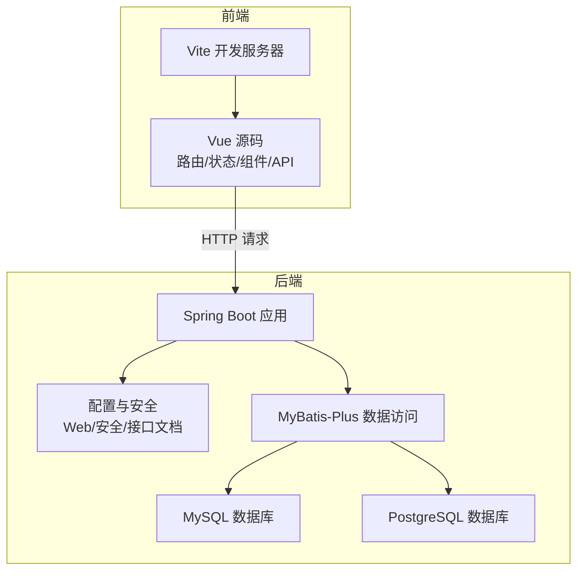
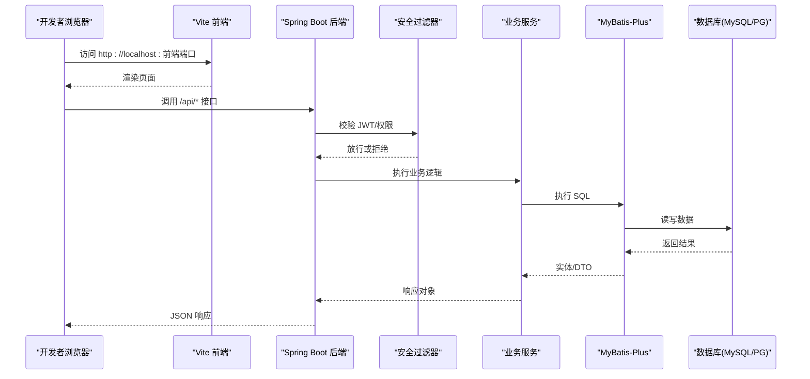
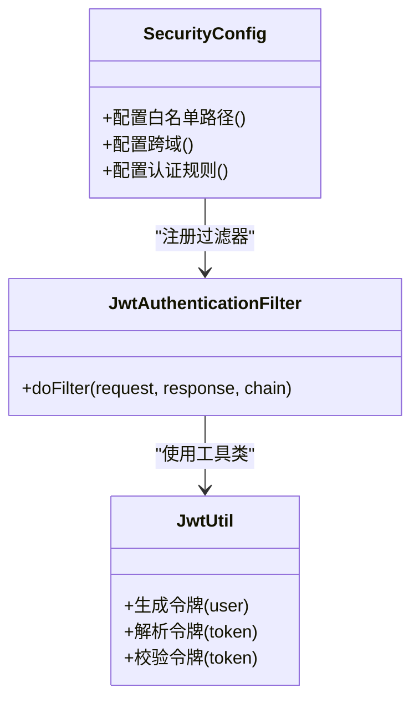
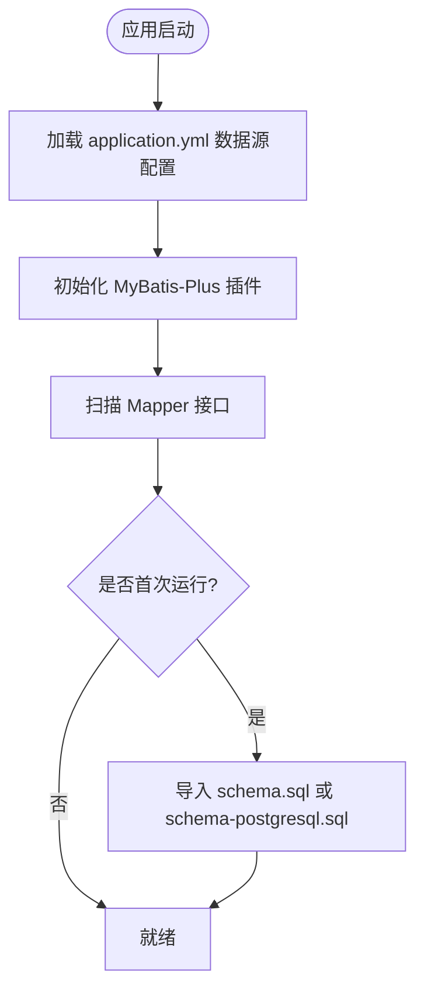
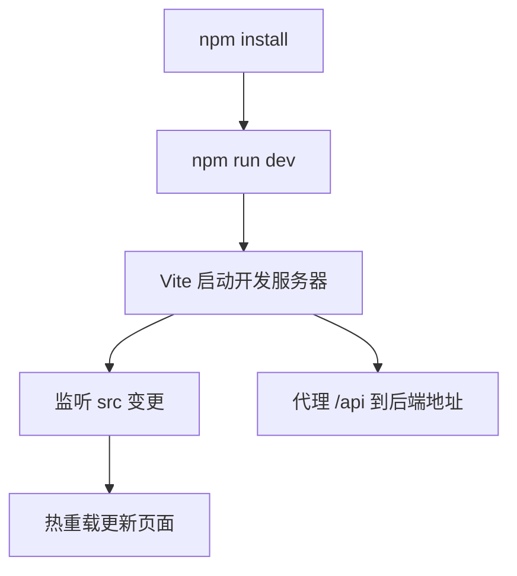
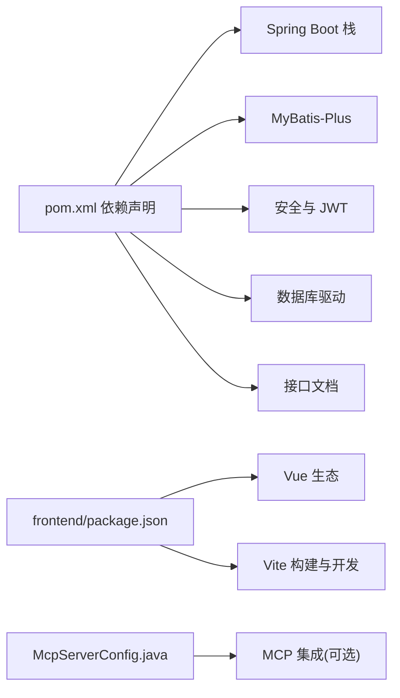

# 本地开发环境部署

<cite>
**本文引用的文件**   
- [pom.xml](file://pom.xml)
- [application.yml](file://src/main/resources/application.yml)
- [schema.sql](file://src/main/resources/schema.sql)
- [schema-postgresql.sql](file://src/main/resources/schema-postgresql.sql)
- [AiLearnApplication.java](file://src/main/java/com/ailearn/AiLearnApplication.java)
- [WebConfig.java](file://src/main/java/com/ailearn/config/WebConfig.java)
- [SpaFallbackController.java](file://src/main/java/com/ailearn/config/SpaFallbackController.java)
- [McpServerConfig.java](file://src/main/java/com/ailearn/config/McpServerConfig.java)
- [OpenApiConfig.java](file://src/main/java/com/ailearn/config/OpenApiConfig.java)
- [MyBatisPlusConfig.java](file://src/main/java/com/ailearn/config/MyBatisPlusConfig.java)
- [SecurityConfig.java](file://src/main/java/com/ailearn/security/SecurityConfig.java)
- [JwtAuthenticationFilter.java](file://src/main/java/com/ailearn/security/JwtAuthenticationFilter.java)
- [JwtUtil.java](file://src/main/java/com/ailearn/security/JwtUtil.java)
- [GlobalExceptionHandler.java](file://src/main/java/com/ailearn/common/GlobalExceptionHandler.java)
- [BusinessException.java](file://src/main/java/com/ailearn/common/BusinessException.java)
- [ErrorCode.java](file://src/main/java/com/ailearn/common/ErrorCode.java)
- [Result.java](file://src/main/java/com/ailearn/common/Result.java)
- [UserMapper.java](file://src/main/java/com/ailearn/mapper/UserMapper.java)
- [ConversationMapper.java](file://src/main/java/com/ailearn/mapper/ConversationMapper.java)
- [ChatMessageMapper.java](file://src/main/java/com/ailearn/mapper/ChatMessageMapper.java)
- [RagDocumentMapper.java](file://src/main/java/com/ailearn/mapper/RagDocumentMapper.java)
- [UserService.java](file://src/main/java/com/ailearn/service/UserService.java)
- [ConversationService.java](file://src/main/java/com/ailearn/service/ConversationService.java)
- [ChatController.java](file://src/main/java/com/ailearn/chat/ChatController.java)
- [ChatService.java](file://src/main/java/com/ailearn/chat/ChatService.java)
- [AgentController.java](file://src/main/java/com/ailearn/agent/AgentController.java)
- [AgentService.java](file://src/main/java/com/ailearn/agent/AgentService.java)
- [MultiAgentController.java](file://src/main/java/com/ailearn/agent/MultiAgentController.java)
- [MultiAgentService.java](file://src/main/java/com/ailearn/agent/MultiAgentService.java)
- [SearchAgentController.java](file://src/main/java/com/ailearn/agent/SearchAgentController.java)
- [SearchAgentService.java](file://src/main/java/com/ailearn/agent/SearchAgentService.java)
- [MemoryChatController.java](file://src/main/java/com/ailearn/memory/MemoryChatController.java)
- [MemoryChatService.java](file://src/main/java/com/ailearn/memory/MemoryChatService.java)
- [DatabaseChatMemory.java](file://src/main/java/com/ailearn/memory/DatabaseChatMemory.java)
- [RagController.java](file://src/main/java/com/ailearn/rag/RagController.java)
- [RagService.java](file://src/main/java/com/ailearn/rag/RagService.java)
- [StructuredOutputController.java](file://src/main/java/com/ailearn/structured/StructuredOutputController.java)
- [StructuredOutputService.java](file://src/main/java/com/ailearn/structured/StructuredOutputService.java)
- [ToolsController.java](file://src/main/java/com/ailearn/tools/ToolsController.java)
- [CalculatorTool.java](file://src/main/java/com/ailearn/tools/CalculatorTool.java)
- [WeatherTool.java](file://src/main/java/com/ailearn/tools/WeatherTool.java)
- [WebSearchTool.java](file://src/main/java/com/ailearn/tools/WebSearchTool.java)
- [SystemController.java](file://src/main/java/com/ailearn/controller/SystemController.java)
- [McpController.java](file://src/main/java/com/ailearn/mcp/McpController.java)
- [SystemTools.java](file://src/main/java/com/ailearn/mcp/SystemTools.java)
- [package.json](file://frontend/package.json)
- [vite.config.js](file://frontend/vite.config.js)
- [index.html](file://frontend/index.html)
- [main.js](file://frontend/src/main.js)
- [App.vue](file://frontend/src/App.vue)
- [router/index.js](file://frontend/src/router/index.js)
- [api/index.js](file://frontend/src/api/index.js)
- [utils/request.js](file://frontend/src/utils/request.js)
- [stores/chat.js](file://frontend/src/stores/chat.js)
- [stores/user.js](file://frontend/src/stores/user.js)
- [views/Home.vue](file://frontend/src/views/Home.vue)
- [views/ChatView.vue](file://frontend/src/views/ChatView.vue)
- [views/AgentView.vue](file://frontend/src/views/AgentView.vue)
- [views/MultiAgentView.vue](file://frontend/src/views/MultiAgentView.vue)
- [views/SearchAgentView.vue](file://frontend/src/views/SearchAgentView.vue)
- [views/MemoryView.vue](file://frontend/src/views/MemoryView.vue)
- [views/RagView.vue](file://frontend/src/views/RagView.vue)
- [views/StructuredView.vue](file://frontend/src/views/StructuredView.vue)
- [views/ToolsView.vue](file://frontend/src/views/ToolsView.vue)
- [components/ChatInput.vue](file://frontend/src/components/ChatInput.vue)
- [components/ChatMessage.vue](file://frontend/src/components/ChatMessage.vue)
- [assets/styles/global.css](file://frontend/src/assets/styles/global.css)
- [DEPLOYMENT.md](file://docs/DEPLOYMENT.md)
</cite>

## 目录
1. [简介](#简介)
2. [项目结构](#项目结构)
3. [核心组件](#核心组件)
4. [架构总览](#架构总览)
5. [详细组件分析](#详细组件分析)
6. [依赖分析](#依赖分析)
7. [性能考虑](#性能考虑)
8. [故障排查指南](#故障排查指南)
9. [结论](#结论)
10. [附录](#附录)

## 简介
本指南面向本地开发者，提供从环境准备、数据库初始化、后端启动到前端开发服务器运行的完整步骤。内容覆盖：
- Java 与 Maven 要求
- Node.js 与前端依赖安装
- MySQL 与 PostgreSQL 的表结构导入
- Spring Boot 应用启动配置与端口设置
- 前端开发服务器与热重载
- 环境变量与配置文件说明
- 常见问题排查与调试技巧

## 项目结构
本项目采用前后端分离架构：
- 后端基于 Spring Boot + MyBatis-Plus，提供 REST API 与安全控制
- 前端基于 Vue 3 + Vite，提供 SPA 页面并通过 API 与后端交互
- 资源目录包含多套数据库脚本（MySQL/PostgreSQL）与应用配置

图表来源
- [AiLearnApplication.java](file://src/main/java/com/ailearn/AiLearnApplication.java)
- [WebConfig.java](file://src/main/java/com/ailearn/config/WebConfig.java)
- [SecurityConfig.java](file://src/main/java/com/ailearn/security/SecurityConfig.java)
- [MyBatisPlusConfig.java](file://src/main/java/com/ailearn/config/MyBatisPlusConfig.java)
- [application.yml](file://src/main/resources/application.yml)

章节来源
- [AiLearnApplication.java](file://src/main/java/com/ailearn/AiLearnApplication.java)
- [application.yml](file://src/main/resources/application.yml)
- [pom.xml](file://pom.xml)

## 核心组件
- 应用入口与模块装配
  - 主类负责应用启动与包扫描
- Web 与安全
  - Web 配置、SPA 回退控制器、跨域与静态资源映射
  - 安全配置、JWT 过滤器与工具类
- 数据访问
  - MyBatis-Plus 配置与 Mapper 接口
- 业务层
  - 聊天、智能体、记忆、RAG、结构化输出、工具等模块
- 前端
  - Vite 开发服务器、路由、状态管理、API 封装与视图组件

章节来源
- [AiLearnApplication.java](file://src/main/java/com/ailearn/AiLearnApplication.java)
- [WebConfig.java](file://src/main/java/com/ailearn/config/WebConfig.java)
- [SpaFallbackController.java](file://src/main/java/com/ailearn/config/SpaFallbackController.java)
- [SecurityConfig.java](file://src/main/java/com/ailearn/security/SecurityConfig.java)
- [JwtAuthenticationFilter.java](file://src/main/java/com/ailearn/security/JwtAuthenticationFilter.java)
- [JwtUtil.java](file://src/main/java/com/ailearn/security/JwtUtil.java)
- [MyBatisPlusConfig.java](file://src/main/java/com/ailearn/config/MyBatisPlusConfig.java)
- [UserMapper.java](file://src/main/java/com/ailearn/mapper/UserMapper.java)
- [ConversationMapper.java](file://src/main/java/com/ailearn/mapper/ConversationMapper.java)
- [ChatMessageMapper.java](file://src/main/java/com/ailearn/mapper/ChatMessageMapper.java)
- [RagDocumentMapper.java](file://src/main/java/com/ailearn/mapper/RagDocumentMapper.java)

## 架构总览
下图展示本地开发时前后端交互与关键配置点：

图表来源
- [JwtAuthenticationFilter.java](file://src/main/java/com/ailearn/security/JwtAuthenticationFilter.java)
- [SecurityConfig.java](file://src/main/java/com/ailearn/security/SecurityConfig.java)
- [ChatController.java](file://src/main/java/com/ailearn/chat/ChatController.java)
- [ChatService.java](file://src/main/java/com/ailearn/chat/ChatService.java)
- [MyBatisPlusConfig.java](file://src/main/java/com/ailearn/config/MyBatisPlusConfig.java)
- [application.yml](file://src/main/resources/application.yml)

## 详细组件分析

### 后端启动与配置
- 应用入口
  - 主类位于应用根包下，负责自动装配与启动
- 端口与上下文路径
  - 通过配置文件指定服务端口与可能的上下文路径
- 静态资源与 SPA 回退
  - 将前端构建产物作为静态资源托管，并对未知路径回退至 index.html
- 接口文档
  - 启用 OpenAPI/Swagger 以便本地调试接口

章节来源
- [AiLearnApplication.java](file://src/main/java/com/ailearn/AiLearnApplication.java)
- [application.yml](file://src/main/resources/application.yml)
- [WebConfig.java](file://src/main/java/com/ailearn/config/WebConfig.java)
- [SpaFallbackController.java](file://src/main/java/com/ailearn/config/SpaFallbackController.java)
- [OpenApiConfig.java](file://src/main/java/com/ailearn/config/OpenApiConfig.java)

### 安全与鉴权
- 安全配置
  - 定义受保护与开放的路径集合、跨域策略
- JWT 过滤器
  - 解析请求头中的令牌并注入认证信息
- 工具类
  - 提供令牌生成与校验方法

图表来源
- [SecurityConfig.java](file://src/main/java/com/ailearn/security/SecurityConfig.java)
- [JwtAuthenticationFilter.java](file://src/main/java/com/ailearn/security/JwtAuthenticationFilter.java)
- [JwtUtil.java](file://src/main/java/com/ailearn/security/JwtUtil.java)

章节来源
- [SecurityConfig.java](file://src/main/java/com/ailearn/security/SecurityConfig.java)
- [JwtAuthenticationFilter.java](file://src/main/java/com/ailearn/security/JwtAuthenticationFilter.java)
- [JwtUtil.java](file://src/main/java/com/ailearn/security/JwtUtil.java)

### 数据访问与数据库
- MyBatis-Plus 配置
  - 配置数据源、分页插件、逻辑删除等
- Mapper 接口
  - 用户、会话、消息、RAG 文档等数据访问抽象
- 数据库脚本
  - 提供 MySQL 与 PostgreSQL 两套建表脚本

图表来源
- [MyBatisPlusConfig.java](file://src/main/java/com/ailearn/config/MyBatisPlusConfig.java)
- [UserMapper.java](file://src/main/java/com/ailearn/mapper/UserMapper.java)
- [ConversationMapper.java](file://src/main/java/com/ailearn/mapper/ConversationMapper.java)
- [ChatMessageMapper.java](file://src/main/java/com/ailearn/mapper/ChatMessageMapper.java)
- [RagDocumentMapper.java](file://src/main/java/com/ailearn/mapper/RagDocumentMapper.java)
- [schema.sql](file://src/main/resources/schema.sql)
- [schema-postgresql.sql](file://src/main/resources/schema-postgresql.sql)
- [application.yml](file://src/main/resources/application.yml)

章节来源
- [MyBatisPlusConfig.java](file://src/main/java/com/ailearn/config/MyBatisPlusConfig.java)
- [UserMapper.java](file://src/main/java/com/ailearn/mapper/UserMapper.java)
- [ConversationMapper.java](file://src/main/java/com/ailearn/mapper/ConversationMapper.java)
- [ChatMessageMapper.java](file://src/main/java/com/ailearn/mapper/ChatMessageMapper.java)
- [RagDocumentMapper.java](file://src/main/java/com/ailearn/mapper/RagDocumentMapper.java)
- [schema.sql](file://src/main/resources/schema.sql)
- [schema-postgresql.sql](file://src/main/resources/schema-postgresql.sql)
- [application.yml](file://src/main/resources/application.yml)

### 业务模块概览
- 聊天与会话
  - 控制器与服务层实现对话流程与持久化
- 智能体与多智能体
  - 提供单/多智能体编排与搜索增强能力
- 记忆与 RAG
  - 基于数据库的记忆存储与检索增强生成
- 结构化输出与工具
  - 结构化结果解析与外部工具调用

章节来源
- [ChatController.java](file://src/main/java/com/ailearn/chat/ChatController.java)
- [ChatService.java](file://src/main/java/com/ailearn/chat/ChatService.java)
- [AgentController.java](file://src/main/java/com/ailearn/agent/AgentController.java)
- [AgentService.java](file://src/main/java/com/ailearn/agent/AgentService.java)
- [MultiAgentController.java](file://src/main/java/com/ailearn/agent/MultiAgentController.java)
- [MultiAgentService.java](file://src/main/java/com/ailearn/agent/MultiAgentService.java)
- [SearchAgentController.java](file://src/main/java/com/ailearn/agent/SearchAgentController.java)
- [SearchAgentService.java](file://src/main/java/com/ailearn/agent/SearchAgentService.java)
- [MemoryChatController.java](file://src/main/java/com/ailearn/memory/MemoryChatController.java)
- [MemoryChatService.java](file://src/main/java/com/ailearn/memory/MemoryChatService.java)
- [DatabaseChatMemory.java](file://src/main/java/com/ailearn/memory/DatabaseChatMemory.java)
- [RagController.java](file://src/main/java/com/ailearn/rag/RagController.java)
- [RagService.java](file://src/main/java/com/ailearn/rag/RagService.java)
- [StructuredOutputController.java](file://src/main/java/com/ailearn/structured/StructuredOutputController.java)
- [StructuredOutputService.java](file://src/main/java/com/ailearn/structured/StructuredOutputService.java)
- [ToolsController.java](file://src/main/java/com/ailearn/tools/ToolsController.java)
- [CalculatorTool.java](file://src/main/java/com/ailearn/tools/CalculatorTool.java)
- [WeatherTool.java](file://src/main/java/com/ailearn/tools/WeatherTool.java)
- [WebSearchTool.java](file://src/main/java/com/ailearn/tools/WebSearchTool.java)

### 前端开发与热重载
- 开发服务器
  - 使用 Vite 启动本地开发服务器，支持热重载
- 代理与跨域
  - 在 Vite 配置中设置 API 代理，避免跨域问题
- 路由与状态
  - 路由集中管理，状态使用模块化 store
- API 封装
  - 统一请求封装与错误处理

图表来源
- [package.json](file://frontend/package.json)
- [vite.config.js](file://frontend/vite.config.js)
- [index.html](file://frontend/index.html)
- [main.js](file://frontend/src/main.js)
- [App.vue](file://frontend/src/App.vue)
- [router/index.js](file://frontend/src/router/index.js)
- [api/index.js](file://frontend/src/api/index.js)
- [utils/request.js](file://frontend/src/utils/request.js)
- [stores/chat.js](file://frontend/src/stores/chat.js)
- [stores/user.js](file://frontend/src/stores/user.js)

章节来源
- [package.json](file://frontend/package.json)
- [vite.config.js](file://frontend/vite.config.js)
- [index.html](file://frontend/index.html)
- [main.js](file://frontend/src/main.js)
- [App.vue](file://frontend/src/App.vue)
- [router/index.js](file://frontend/src/router/index.js)
- [api/index.js](file://frontend/src/api/index.js)
- [utils/request.js](file://frontend/src/utils/request.js)
- [stores/chat.js](file://frontend/src/stores/chat.js)
- [stores/user.js](file://frontend/src/stores/user.js)

## 依赖分析
- 后端依赖
  - Spring Boot、MyBatis-Plus、安全框架、数据库驱动、日志与接口文档
- 前端依赖
  - Vue 生态、Vite、状态管理与路由
- 外部集成
  - MCP 服务器配置（可选）

图表来源
- [pom.xml](file://pom.xml)
- [package.json](file://frontend/package.json)
- [McpServerConfig.java](file://src/main/java/com/ailearn/config/McpServerConfig.java)

章节来源
- [pom.xml](file://pom.xml)
- [package.json](file://frontend/package.json)
- [McpServerConfig.java](file://src/main/java/com/ailearn/config/McpServerConfig.java)

## 性能考虑
- 连接池与线程池
  - 合理配置数据库连接池大小与 Tomcat 线程数，避免阻塞
- 缓存与索引
  - 对高频查询字段建立索引；必要时引入缓存层
- 分页与批量
  - 使用分页插件限制单次返回量；批量操作减少往返
- 日志级别
  - 开发环境开启详细日志，生产降低级别以减少开销

[本节为通用指导，不直接分析具体文件]

## 故障排查指南
- 端口冲突
  - 检查应用端口占用，修改配置后重启
- 数据库连接失败
  - 核对用户名、密码、URL、驱动与字符集；确认防火墙与网络可达
- 跨域与代理
  - 前端代理需指向正确的后端地址；确保后端允许对应来源
- 安全拦截
  - 确认白名单路径未误配；JWT 令牌格式与有效期正确
- 静态资源与 SPA
  - 确认静态资源路径与回退控制器生效
- 全局异常
  - 查看统一异常处理器返回码与消息，定位业务异常

章节来源
- [application.yml](file://src/main/resources/application.yml)
- [WebConfig.java](file://src/main/java/com/ailearn/config/WebConfig.java)
- [SpaFallbackController.java](file://src/main/java/com/ailearn/config/SpaFallbackController.java)
- [SecurityConfig.java](file://src/main/java/com/ailearn/security/SecurityConfig.java)
- [JwtAuthenticationFilter.java](file://src/main/java/com/ailearn/security/JwtAuthenticationFilter.java)
- [GlobalExceptionHandler.java](file://src/main/java/com/ailearn/common/GlobalExceptionHandler.java)
- [BusinessException.java](file://src/main/java/com/ailearn/common/BusinessException.java)
- [ErrorCode.java](file://src/main/java/com/ailearn/common/ErrorCode.java)
- [Result.java](file://src/main/java/com/ailearn/common/Result.java)

## 结论
按照本指南完成环境准备、数据库初始化与前后端启动后，即可在本地进行功能开发与联调。建议结合接口文档与日志快速定位问题，并根据实际负载调整连接池与线程池参数以获得更稳定的体验。

## 附录

### 环境要求与安装
- JDK
  - 版本：参考项目依赖声明
  - 安装后验证 java -version
- Maven
  - 版本：推荐 3.8+
  - 配置国内镜像加速下载
- Node.js
  - 版本：参考前端工程要求
  - 安装后验证 node -version 与 npm -version

章节来源
- [pom.xml](file://pom.xml)
- [package.json](file://frontend/package.json)

### 数据库初始化
- MySQL
  - 创建数据库与用户
  - 导入脚本：src/main/resources/schema.sql
- PostgreSQL
  - 创建数据库与用户
  - 导入脚本：src/main/resources/schema-postgresql.sql

章节来源
- [schema.sql](file://src/main/resources/schema.sql)
- [schema-postgresql.sql](file://src/main/resources/schema-postgresql.sql)

### 后端启动与端口设置
- 启动方式
  - 使用 IDE 运行主类或通过命令行打包运行
- 端口与上下文路径
  - 在配置文件中设置服务端口与上下文路径
- 静态资源与 SPA
  - 将前端构建产物放置于静态资源目录，并启用回退控制器

章节来源
- [AiLearnApplication.java](file://src/main/java/com/ailearn/AiLearnApplication.java)
- [application.yml](file://src/main/resources/application.yml)
- [WebConfig.java](file://src/main/java/com/ailearn/config/WebConfig.java)
- [SpaFallbackController.java](file://src/main/java/com/ailearn/config/SpaFallbackController.java)

### 前端开发服务器与热重载
- 安装依赖
  - 进入 frontend 目录执行安装命令
- 启动开发服务器
  - 执行开发命令以启动 Vite 并启用热重载
- 代理配置
  - 在 Vite 配置中将 /api 代理到后端地址

章节来源
- [package.json](file://frontend/package.json)
- [vite.config.js](file://frontend/vite.config.js)

### 环境变量与配置文件
- 应用配置
  - 数据库连接、端口、日志、安全与第三方服务密钥等
- 示例与环境切换
  - 可通过不同配置文件或环境变量切换开发/测试环境

章节来源
- [application.yml](file://src/main/resources/application.yml)

### 常见调试技巧
- 接口文档
  - 启动后访问接口文档页面，在线调试
- 日志
  - 开启 DEBUG 级别，关注异常堆栈与慢查询
- 断点调试
  - 在控制器、服务层与过滤器处设置断点逐步排查

章节来源
- [OpenApiConfig.java](file://src/main/java/com/ailearn/config/OpenApiConfig.java)
- [GlobalExceptionHandler.java](file://src/main/java/com/ailearn/common/GlobalExceptionHandler.java)