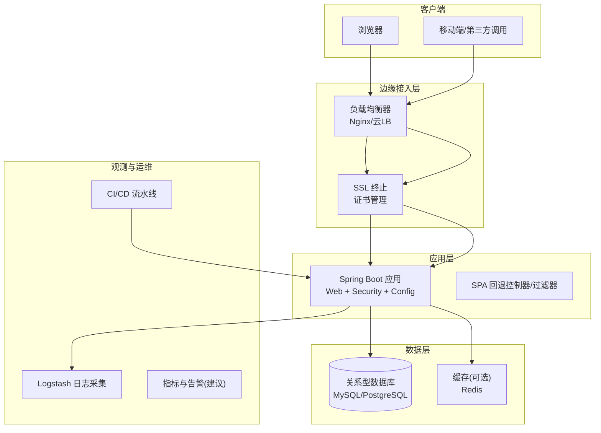
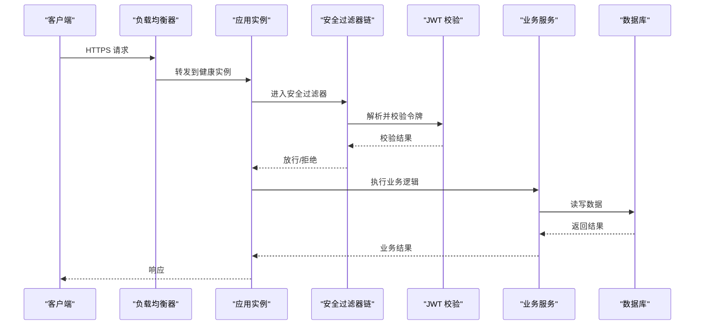
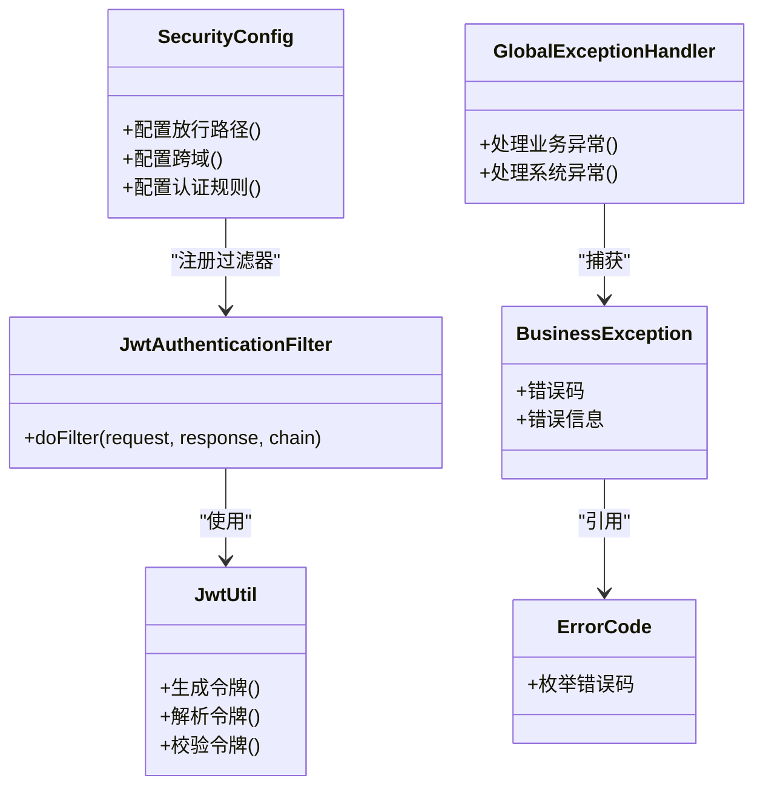
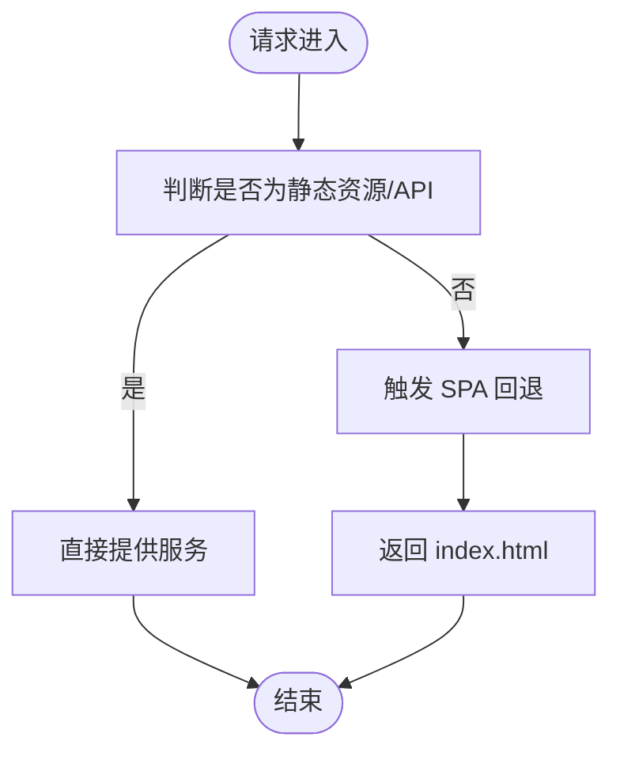
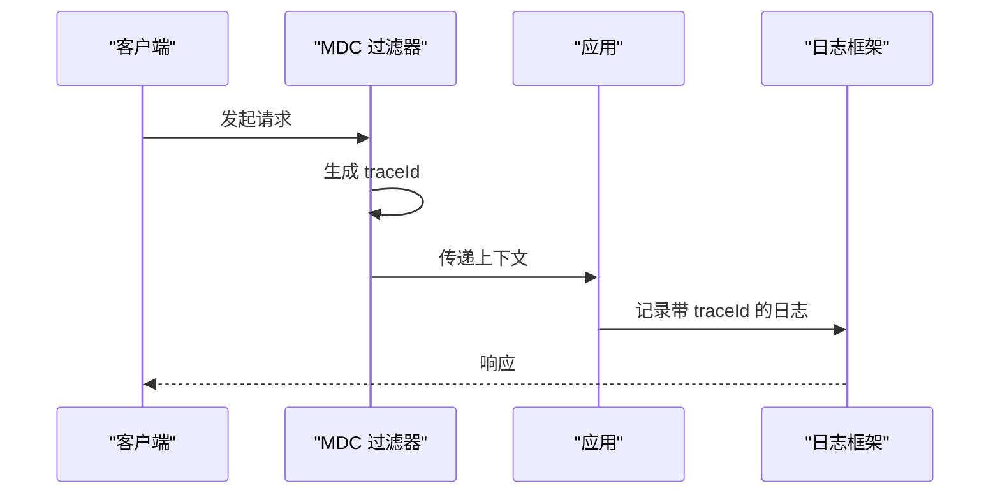
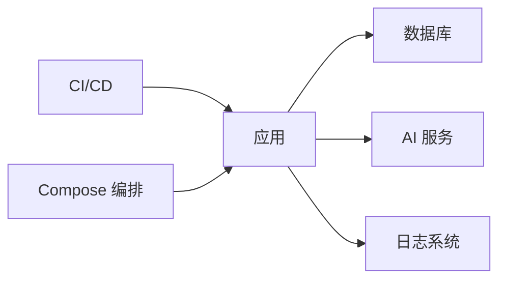

# 生产环境部署

<cite>
**本文引用的文件**   
- [docker-compose.yml](file://docker-compose.yml)
- [Dockerfile](file://Dockerfile)
- [src/main/resources/application.yml](file://src/main/resources/application.yml)
- [src/main/resources/logback-spring.xml](file://src/main/resources/logback-spring.xml)
- [src/main/java/com/ailearn/config/WebConfig.java](file://src/main/java/com/ailearn/config/WebConfig.java)
- [src/main/java/com/ailearn/config/SpaFallbackController.java](file://src/main/java/com/ailearn/config/SpaFallbackController.java)
- [src/main/java/com/ailearn/config/SpaFallbackFilter.java](file://src/main/java/com/ailearn/config/SpaFallbackFilter.java)
- [src/main/java/com/ailearn/security/SecurityConfig.java](file://src/main/java/com/ailearn/security/SecurityConfig.java)
- [src/main/java/com/ailearn/security/JwtAuthenticationFilter.java](file://src/main/java/com/ailearn/security/JwtAuthenticationFilter.java)
- [src/main/java/com/ailearn/security/JwtUtil.java](file://src/main/java/com/ailearn/security/JwtUtil.java)
- [src/main/java/com/ailearn/config/MdcTraceFilter.java](file://src/main/java/com/ailearn/config/MdcTraceFilter.java)
- [src/main/java/com/ailearn/config/RateLimiterConfig.java](file://src/main/java/com/ailearn/config/RateLimiterConfig.java)
- [src/main/java/com/ailearn/config/OpenApiConfig.java](file://src/main/java/com/ailearn/config/OpenApiConfig.java)
- [src/main/java/com/ailearn/config/AiConfig.java](file://src/main/java/com/ailearn/config/AiConfig.java)
- [src/main/java/com/ailearn/config/MyBatisPlusConfig.java](file://src/main/java/com/ailearn/config/MyBatisPlusConfig.java)
- [src/main/java/com/ailearn/config/McpServerConfig.java](file://src/main/java/com/ailearn/config/McpServerConfig.java)
- [src/main/java/com/ailearn/common/GlobalExceptionHandler.java](file://src/main/java/com/ailearn/common/GlobalExceptionHandler.java)
- [src/main/java/com/ailearn/common/BusinessException.java](file://src/main/java/com/ailearn/common/BusinessException.java)
- [src/main/java/com/ailearn/common/ErrorCode.java](file://src/main/java/com/ailearn/common/ErrorCode.java)
- [src/main/resources/schema.sql](file://src/main/resources/schema.sql)
- [src/main/resources/schema-postgresql.sql](file://src/main/resources/schema-postgresql.sql)
- [.github/workflows/ci-cd.yml](file://.github/workflows/ci-cd.yml)
- [docker/app/Dockerfile](file://docker/app/Dockerfile)
- [docker/logstash/config/logstash.yml](file://docker/logstash/config/logstash.yml)
- [docker/logstash/pipeline/logstash.conf](file://docker/logstash/pipeline/logstash.conf)
</cite>

## 目录
1. [简介](#简介)
2. [项目结构](#项目结构)
3. [核心组件](#核心组件)
4. [架构总览](#架构总览)
5. [详细组件分析](#详细组件分析)
6. [依赖分析](#依赖分析)
7. [性能考虑](#性能考虑)
8. [故障排查指南](#故障排查指南)
9. [结论](#结论)
10. [附录](#附录)

## 简介
本指南面向生产环境的系统规划与部署，覆盖系统要求、硬件规划、多环境配置管理、安全加固、负载均衡与高可用、数据库集群与备份恢复、SSL/HTTPS、性能调优、监控告警与日志收集、灰度发布与蓝绿策略、容量规划与扩展性设计等主题。文档内容严格基于仓库现有实现与配置进行解读与建议，确保可落地执行。

## 项目结构
仓库采用前后端分离的单体应用形态，后端为 Spring Boot 应用，前端通过静态资源或反向代理提供；容器化使用 Docker 与 docker-compose 编排；CI/CD 使用 GitHub Actions；日志采集使用 Logstash。

图表来源
- [docker-compose.yml](file://docker-compose.yml)
- [src/main/resources/application.yml](file://src/main/resources/application.yml)
- [src/main/java/com/ailearn/config/WebConfig.java](file://src/main/java/com/ailearn/config/WebConfig.java)
- [src/main/java/com/ailearn/config/SpaFallbackController.java](file://src/main/java/com/ailearn/config/SpaFallbackController.java)
- [src/main/java/com/ailearn/config/SpaFallbackFilter.java](file://src/main/java/com/ailearn/config/SpaFallbackFilter.java)
- [src/main/java/com/ailearn/security/SecurityConfig.java](file://src/main/java/com/ailearn/security/SecurityConfig.java)
- [src/main/java/com/ailearn/security/JwtAuthenticationFilter.java](file://src/main/java/com/ailearn/security/JwtAuthenticationFilter.java)
- [src/main/java/com/ailearn/security/JwtUtil.java](file://src/main/java/com/ailearn/security/JwtUtil.java)
- [src/main/java/com/ailearn/config/MdcTraceFilter.java](file://src/main/java/com/ailearn/config/MdcTraceFilter.java)
- [src/main/java/com/ailearn/config/RateLimiterConfig.java](file://src/main/java/com/ailearn/config/RateLimiterConfig.java)
- [src/main/java/com/ailearn/config/OpenApiConfig.java](file://src/main/java/com/ailearn/config/OpenApiConfig.java)
- [src/main/java/com/ailearn/config/AiConfig.java](file://src/main/java/com/ailearn/config/AiConfig.java)
- [src/main/java/com/ailearn/config/MyBatisPlusConfig.java](file://src/main/java/com/ailearn/config/MyBatisPlusConfig.java)
- [src/main/java/com/ailearn/config/McpServerConfig.java](file://src/main/java/com/ailearn/config/McpServerConfig.java)
- [src/main/resources/logback-spring.xml](file://src/main/resources/logback-spring.xml)
- [.github/workflows/ci-cd.yml](file://.github/workflows/ci-cd.yml)

章节来源
- [docker-compose.yml](file://docker-compose.yml)
- [Dockerfile](file://Dockerfile)
- [src/main/resources/application.yml](file://src/main/resources/application.yml)
- [src/main/resources/logback-spring.xml](file://src/main/resources/logback-spring.xml)
- [src/main/java/com/ailearn/config/WebConfig.java](file://src/main/java/com/ailearn/config/WebConfig.java)
- [src/main/java/com/ailearn/config/SpaFallbackController.java](file://src/main/java/com/ailearn/config/SpaFallbackController.java)
- [src/main/java/com/ailearn/config/SpaFallbackFilter.java](file://src/main/java/com/ailearn/config/SpaFallbackFilter.java)
- [src/main/java/com/ailearn/security/SecurityConfig.java](file://src/main/java/com/ailearn/security/SecurityConfig.java)
- [src/main/java/com/ailearn/security/JwtAuthenticationFilter.java](file://src/main/java/com/ailearn/security/JwtAuthenticationFilter.java)
- [src/main/java/com/ailearn/security/JwtUtil.java](file://src/main/java/com/ailearn/security/JwtUtil.java)
- [src/main/java/com/ailearn/config/MdcTraceFilter.java](file://src/main/java/com/ailearn/config/MdcTraceFilter.java)
- [src/main/java/com/ailearn/config/RateLimiterConfig.java](file://src/main/java/com/ailearn/config/RateLimiterConfig.java)
- [src/main/java/com/ailearn/config/OpenApiConfig.java](file://src/main/java/com/ailearn/config/OpenApiConfig.java)
- [src/main/java/com/ailearn/config/AiConfig.java](file://src/main/java/com/ailearn/config/AiConfig.java)
- [src/main/java/com/ailearn/config/MyBatisPlusConfig.java](file://src/main/java/com/ailearn/config/MyBatisPlusConfig.java)
- [src/main/java/com/ailearn/config/McpServerConfig.java](file://src/main/java/com/ailearn/config/McpServerConfig.java)
- [.github/workflows/ci-cd.yml](file://.github/workflows/ci-cd.yml)

## 核心组件
- Web 与安全
  - Web 配置与 SPA 回退：用于统一入口与前端路由回退处理。
  - 安全配置：启用认证授权、跨域、白名单放行等。
  - JWT 鉴权：请求过滤、令牌校验与用户上下文构建。
- 可观测性与稳定性
  - MDC 链路追踪：在日志中注入 traceId，便于问题定位。
  - 限流配置：全局或接口级限流保护。
  - 全局异常处理：统一错误码与响应体。
- 外部集成与数据访问
  - AI 配置：外部 AI 服务连接参数。
  - MyBatis Plus 配置：数据访问增强。
  - MCP Server 配置：工具/协议相关设置。
- 日志与 API 文档
  - OpenAPI 配置：接口文档开关与路径。
  - Logback 配置：日志级别、输出格式与滚动策略。

章节来源
- [src/main/java/com/ailearn/config/WebConfig.java](file://src/main/java/com/ailearn/config/WebConfig.java)
- [src/main/java/com/ailearn/config/SpaFallbackController.java](file://src/main/java/com/ailearn/config/SpaFallbackController.java)
- [src/main/java/com/ailearn/config/SpaFallbackFilter.java](file://src/main/java/com/ailearn/config/SpaFallbackFilter.java)
- [src/main/java/com/ailearn/security/SecurityConfig.java](file://src/main/java/com/ailearn/security/SecurityConfig.java)
- [src/main/java/com/ailearn/security/JwtAuthenticationFilter.java](file://src/main/java/com/ailearn/security/JwtAuthenticationFilter.java)
- [src/main/java/com/ailearn/security/JwtUtil.java](file://src/main/java/com/ailearn/security/JwtUtil.java)
- [src/main/java/com/ailearn/config/MdcTraceFilter.java](file://src/main/java/com/ailearn/config/MdcTraceFilter.java)
- [src/main/java/com/ailearn/config/RateLimiterConfig.java](file://src/main/java/com/ailearn/config/RateLimiterConfig.java)
- [src/main/java/com/ailearn/common/GlobalExceptionHandler.java](file://src/main/java/com/ailearn/common/GlobalExceptionHandler.java)
- [src/main/java/com/ailearn/common/BusinessException.java](file://src/main/java/com/ailearn/common/BusinessException.java)
- [src/main/java/com/ailearn/common/ErrorCode.java](file://src/main/java/com/ailearn/common/ErrorCode.java)
- [src/main/java/com/ailearn/config/OpenApiConfig.java](file://src/main/java/com/ailearn/config/OpenApiConfig.java)
- [src/main/java/com/ailearn/config/AiConfig.java](file://src/main/java/com/ailearn/config/AiConfig.java)
- [src/main/java/com/ailearn/config/MyBatisPlusConfig.java](file://src/main/java/com/ailearn/config/MyBatisPlusConfig.java)
- [src/main/java/com/ailearn/config/McpServerConfig.java](file://src/main/java/com/ailearn/config/McpServerConfig.java)
- [src/main/resources/logback-spring.xml](file://src/main/resources/logback-spring.xml)

## 架构总览
生产环境推荐分层架构：边缘接入（负载均衡+SSL 终止）→ 应用集群（无状态实例）→ 数据层（主从/集群）→ 观测体系（日志/指标/告警）。

图表来源
- [src/main/java/com/ailearn/security/SecurityConfig.java](file://src/main/java/com/ailearn/security/SecurityConfig.java)
- [src/main/java/com/ailearn/security/JwtAuthenticationFilter.java](file://src/main/java/com/ailearn/security/JwtAuthenticationFilter.java)
- [src/main/java/com/ailearn/security/JwtUtil.java](file://src/main/java/com/ailearn/security/JwtUtil.java)
- [src/main/resources/application.yml](file://src/main/resources/application.yml)

## 详细组件分析

### 安全与认证组件
- 安全配置
  - 定义放行路径、跨域策略、会话与权限控制。
  - 结合网关/负载均衡做 TLS 终止与 WAF 防护。
- JWT 鉴权
  - 过滤器拦截请求，解析 Token，填充用户上下文。
  - 工具类负责令牌生成与校验。
- 全局异常与错误码
  - 统一异常捕获，返回标准错误结构与错误码。

图表来源
- [src/main/java/com/ailearn/security/SecurityConfig.java](file://src/main/java/com/ailearn/security/SecurityConfig.java)
- [src/main/java/com/ailearn/security/JwtAuthenticationFilter.java](file://src/main/java/com/ailearn/security/JwtAuthenticationFilter.java)
- [src/main/java/com/ailearn/security/JwtUtil.java](file://src/main/java/com/ailearn/security/JwtUtil.java)
- [src/main/java/com/ailearn/common/GlobalExceptionHandler.java](file://src/main/java/com/ailearn/common/GlobalExceptionHandler.java)
- [src/main/java/com/ailearn/common/BusinessException.java](file://src/main/java/com/ailearn/common/BusinessException.java)
- [src/main/java/com/ailearn/common/ErrorCode.java](file://src/main/java/com/ailearn/common/ErrorCode.java)

章节来源
- [src/main/java/com/ailearn/security/SecurityConfig.java](file://src/main/java/com/ailearn/security/SecurityConfig.java)
- [src/main/java/com/ailearn/security/JwtAuthenticationFilter.java](file://src/main/java/com/ailearn/security/JwtAuthenticationFilter.java)
- [src/main/java/com/ailearn/security/JwtUtil.java](file://src/main/java/com/ailearn/security/JwtUtil.java)
- [src/main/java/com/ailearn/common/GlobalExceptionHandler.java](file://src/main/java/com/ailearn/common/GlobalExceptionHandler.java)
- [src/main/java/com/ailearn/common/BusinessException.java](file://src/main/java/com/ailearn/common/BusinessException.java)
- [src/main/java/com/ailearn/common/ErrorCode.java](file://src/main/java/com/ailearn/common/ErrorCode.java)

### Web 与 SPA 回退
- Web 配置
  - 静态资源映射、拦截器注册、视图解析等。
- SPA 回退
  - 控制器与过滤器配合，将未知路径回退至 index.html，支持前端路由。

图表来源
- [src/main/java/com/ailearn/config/WebConfig.java](file://src/main/java/com/ailearn/config/WebConfig.java)
- [src/main/java/com/ailearn/config/SpaFallbackController.java](file://src/main/java/com/ailearn/config/SpaFallbackController.java)
- [src/main/java/com/ailearn/config/SpaFallbackFilter.java](file://src/main/java/com/ailearn/config/SpaFallbackFilter.java)

章节来源
- [src/main/java/com/ailearn/config/WebConfig.java](file://src/main/java/com/ailearn/config/WebConfig.java)
- [src/main/java/com/ailearn/config/SpaFallbackController.java](file://src/main/java/com/ailearn/config/SpaFallbackController.java)
- [src/main/java/com/ailearn/config/SpaFallbackFilter.java](file://src/main/java/com/ailearn/config/SpaFallbackFilter.java)

### 可观测性与稳定性
- MDC 链路追踪
  - 过滤器注入 traceId，贯穿日志输出，便于分布式排查。
- 限流
  - 全局或按接口维度限制 QPS，防止雪崩。
- 全局异常
  - 统一错误码与响应结构，提升前端体验与自动化处理。

图表来源
- [src/main/java/com/ailearn/config/MdcTraceFilter.java](file://src/main/java/com/ailearn/config/MdcTraceFilter.java)
- [src/main/resources/logback-spring.xml](file://src/main/resources/logback-spring.xml)
- [src/main/java/com/ailearn/config/RateLimiterConfig.java](file://src/main/java/com/ailearn/config/RateLimiterConfig.java)
- [src/main/java/com/ailearn/common/GlobalExceptionHandler.java](file://src/main/java/com/ailearn/common/GlobalExceptionHandler.java)

章节来源
- [src/main/java/com/ailearn/config/MdcTraceFilter.java](file://src/main/java/com/ailearn/config/MdcTraceFilter.java)
- [src/main/resources/logback-spring.xml](file://src/main/resources/logback-spring.xml)
- [src/main/java/com/ailearn/config/RateLimiterConfig.java](file://src/main/java/com/ailearn/config/RateLimiterConfig.java)
- [src/main/java/com/ailearn/common/GlobalExceptionHandler.java](file://src/main/java/com/ailearn/common/GlobalExceptionHandler.java)

### 外部集成与数据访问
- AI 配置
  - 外部 AI 服务地址、密钥、超时等参数集中管理。
- MyBatis Plus
  - 数据访问增强、分页、自动填充等。
- MCP Server
  - 工具/协议相关配置项。

章节来源
- [src/main/java/com/ailearn/config/AiConfig.java](file://src/main/java/com/ailearn/config/AiConfig.java)
- [src/main/java/com/ailearn/config/MyBatisPlusConfig.java](file://src/main/java/com/ailearn/config/MyBatisPlusConfig.java)
- [src/main/java/com/ailearn/config/McpServerConfig.java](file://src/main/java/com/ailearn/config/McpServerConfig.java)

### 日志与 API 文档
- OpenAPI
  - 文档开关、路径、版本等。
- Logback
  - 日志级别、输出格式、滚动策略、异步输出等。

章节来源
- [src/main/java/com/ailearn/config/OpenApiConfig.java](file://src/main/java/com/ailearn/config/OpenApiConfig.java)
- [src/main/resources/logback-spring.xml](file://src/main/resources/logback-spring.xml)

## 依赖分析
- 运行时依赖
  - 关系型数据库：由 SQL 脚本定义表结构，支持 MySQL/PostgreSQL。
  - 外部 AI 服务：通过配置注入连接参数。
- 容器与编排
  - Docker 镜像构建与 Compose 编排，便于本地与生产一致化运行。
- CI/CD
  - GitHub Actions 流水线驱动构建与部署。

图表来源
- [src/main/resources/schema.sql](file://src/main/resources/schema.sql)
- [src/main/resources/schema-postgresql.sql](file://src/main/resources/schema-postgresql.sql)
- [docker-compose.yml](file://docker-compose.yml)
- [.github/workflows/ci-cd.yml](file://.github/workflows/ci-cd.yml)

章节来源
- [src/main/resources/schema.sql](file://src/main/resources/schema.sql)
- [src/main/resources/schema-postgresql.sql](file://src/main/resources/schema-postgresql.sql)
- [docker-compose.yml](file://docker-compose.yml)
- [.github/workflows/ci-cd.yml](file://.github/workflows/ci-cd.yml)

## 性能考虑
- JVM 与容器
  - 合理设置堆大小、GC 策略、CPU 与内存限制，避免 OOM 与抖动。
- 连接池与线程池
  - 根据并发与延迟目标调整数据库连接池、HTTP 客户端与线程池大小。
- 缓存与降级
  - 热点数据缓存、外部服务熔断与降级，降低尾部延迟。
- 静态资源与压缩
  - 开启 Gzip/Brotli、静态资源缓存、CDN 加速。
- 数据库
  - 索引优化、慢查询治理、读写分离与分库分表评估。

[本节为通用指导，不直接分析具体文件]

## 故障排查指南
- 日志定位
  - 使用 traceId 串联请求链路，快速定位问题节点。
- 统一错误码
  - 通过错误码与消息快速识别业务异常类型。
- 限流与熔断
  - 观察限流命中情况，必要时扩容或优化接口。
- 健康检查与自愈
  - 结合负载均衡与健康检查实现自动摘除与恢复。

章节来源
- [src/main/java/com/ailearn/config/MdcTraceFilter.java](file://src/main/java/com/ailearn/config/MdcTraceFilter.java)
- [src/main/java/com/ailearn/common/GlobalExceptionHandler.java](file://src/main/java/com/ailearn/common/GlobalExceptionHandler.java)
- [src/main/java/com/ailearn/common/ErrorCode.java](file://src/main/java/com/ailearn/common/ErrorCode.java)
- [src/main/java/com/ailearn/config/RateLimiterConfig.java](file://src/main/java/com/ailearn/config/RateLimiterConfig.java)

## 结论
本指南基于仓库现有实现，给出了生产环境从系统规划、安全加固、高可用、数据库、SSL/HTTPS、性能调优、监控日志到发布策略的全景方案。建议在上线前完成压测与演练，持续完善监控与告警，逐步演进到更完善的微服务与多云多活架构。

[本节为总结性内容，不直接分析具体文件]

## 附录

### 一、系统要求与硬件规划
- 操作系统
  - Linux 发行版（CentOS/Ubuntu/Debian），内核版本满足容器运行时要求。
- 运行时
  - JDK 版本与 Spring Boot 兼容；容器镜像基础镜像选择稳定版本。
- CPU/内存/磁盘/网络
  - 依据压测结果确定单实例规格与副本数；数据库独立主机或托管服务。
- 端口与防火墙
  - 开放 80/443（经 LB），内部仅暴露必要端口。

章节来源
- [Dockerfile](file://Dockerfile)
- [docker/app/Dockerfile](file://docker/app/Dockerfile)
- [src/main/resources/application.yml](file://src/main/resources/application.yml)

### 二、多环境配置管理策略
- 配置文件分层
  - 公共配置、环境差异化配置（dev/test/staging/prod）通过环境变量或外部配置中心注入。
- 敏感信息
  - 密钥、密码、Token 等通过环境变量或密钥管理服务注入，禁止硬编码。
- 启动参数
  - 通过 Compose 或编排平台传入不同环境的 profile 与参数。

章节来源
- [src/main/resources/application.yml](file://src/main/resources/application.yml)
- [docker-compose.yml](file://docker-compose.yml)

### 三、生产环境安全加固措施
- 最小权限
  - 容器以非 root 用户运行，文件系统只读挂载。
- 网络安全
  - 仅开放必要端口，启用网络隔离与白名单。
- 身份与访问控制
  - 启用 JWT 鉴权，关闭调试接口，限制管理面访问。
- 输入校验与防攻击
  - 启用限流、CORS 白名单、SQL 注入防护、XSS 防护。
- 审计与合规
  - 开启访问日志、操作审计，定期漏洞扫描。

章节来源
- [src/main/java/com/ailearn/security/SecurityConfig.java](file://src/main/java/com/ailearn/security/SecurityConfig.java)
- [src/main/java/com/ailearn/security/JwtAuthenticationFilter.java](file://src/main/java/com/ailearn/security/JwtAuthenticationFilter.java)
- [src/main/java/com/ailearn/security/JwtUtil.java](file://src/main/java/com/ailearn/security/JwtUtil.java)
- [src/main/java/com/ailearn/config/RateLimiterConfig.java](file://src/main/java/com/ailearn/config/RateLimiterConfig.java)

### 四、负载均衡与高可用架构
- 负载均衡
  - 使用 Nginx 或云厂商 LB，配置健康检查与权重。
- 多副本部署
  - 应用无状态化，水平扩展；会话外置（如 Redis）。
- 故障转移
  - 健康检查失败自动摘除，重启失败自动替换。
- 区域容灾
  - 多可用区部署，数据库主从/集群，跨区复制。

章节来源
- [docker-compose.yml](file://docker-compose.yml)
- [src/main/java/com/ailearn/config/WebConfig.java](file://src/main/java/com/ailearn/config/WebConfig.java)

### 五、数据库集群配置与备份恢复
- 集群模式
  - 主从复制/读写分离，或托管数据库的高可用版。
- 连接与事务
  - 合理设置连接池大小、事务超时与重试策略。
- 备份策略
  - 全量+增量备份，异地存储，定期演练恢复。
- 迁移与版本
  - 使用脚本或迁移工具管理 DDL，变更可回滚。

章节来源
- [src/main/resources/schema.sql](file://src/main/resources/schema.sql)
- [src/main/resources/schema-postgresql.sql](file://src/main/resources/schema-postgresql.sql)
- [src/main/java/com/ailearn/config/MyBatisPlusConfig.java](file://src/main/java/com/ailearn/config/MyBatisPlusConfig.java)

### 六、SSL 证书配置与 HTTPS 访问
- 证书来源
  - 使用可信 CA 签发的证书，私钥妥善保管。
- 终止位置
  - 建议在负载均衡处终止 TLS，减轻应用压力。
- 强制跳转
  - HTTP 自动跳转到 HTTPS，启用 HSTS。
- 证书轮换
  - 自动化续期与热更新流程。

章节来源
- [src/main/resources/application.yml](file://src/main/resources/application.yml)
- [src/main/java/com/ailearn/config/WebConfig.java](file://src/main/java/com/ailearn/config/WebConfig.java)

### 七、性能调优参数与资源分配
- JVM 参数
  - 堆大小、新生代比例、GC 算法与日志。
- 线程与连接
  - 线程池、数据库连接池、HTTP 客户端连接复用。
- 缓存与压缩
  - 启用页面/接口缓存、静态资源压缩与 CDN。
- 监控与压测
  - 建立基线，持续压测与容量评估。

章节来源
- [src/main/resources/application.yml](file://src/main/resources/application.yml)
- [src/main/java/com/ailearn/config/RateLimiterConfig.java](file://src/main/java/com/ailearn/config/RateLimiterConfig.java)

### 八、监控告警与日志收集
- 指标与告警
  - 建议引入 Prometheus/Grafana 或云监控，对关键指标设置阈值告警。
- 日志采集
  - 应用输出结构化日志，Logstash 采集并转发至集中式存储。
- 链路追踪
  - 基于 traceId 关联日志与指标，提升排障效率。

章节来源
- [src/main/resources/logback-spring.xml](file://src/main/resources/logback-spring.xml)
- [docker/logstash/config/logstash.yml](file://docker/logstash/config/logstash.yml)
- [docker/logstash/pipeline/logstash.conf](file://docker/logstash/pipeline/logstash.conf)
- [src/main/java/com/ailearn/config/MdcTraceFilter.java](file://src/main/java/com/ailearn/config/MdcTraceFilter.java)

### 九、灰度发布与蓝绿部署
- 灰度发布
  - 按流量比例或用户标签分流，逐步放量。
- 蓝绿部署
  - 两套环境并行，切换流量入口，快速回滚。
- 健康检查与回滚
  - 发布后验证健康与核心用例，异常立即回滚。

章节来源
- [.github/workflows/ci-cd.yml](file://.github/workflows/ci-cd.yml)
- [docker-compose.yml](file://docker-compose.yml)

### 十、容量规划与扩展性设计
- 容量模型
  - 基于 QPS、P99 延迟、CPU/内存利用率估算单实例能力与副本数。
- 弹性伸缩
  - 基于指标自动扩缩容，预留冷启动时间。
- 解耦与异步
  - 引入消息队列与任务队列，削峰填谷。
- 数据层扩展
  - 读写分离、分片、冷热数据分层。

[本节为通用指导，不直接分析具体文件]