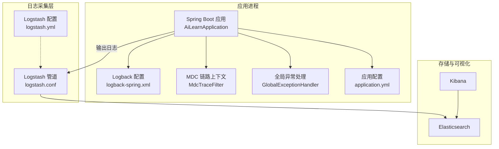
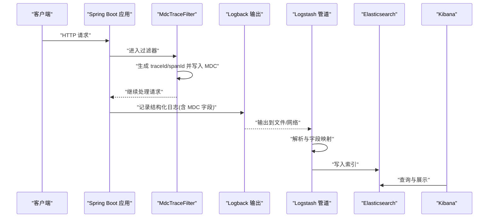
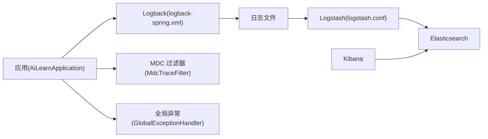

# 监控与日志收集

<cite>
**本文引用的文件**   
- [logback-spring.xml](file://src/main/resources/logback-spring.xml)
- [application.yml](file://src/main/resources/application.yml)
- [MdcTraceFilter.java](file://src/main/java/com/ailearn/config/MdcTraceFilter.java)
- [GlobalExceptionHandler.java](file://src/main/java/com/ailearn/common/GlobalExceptionHandler.java)
- [AiLearnApplication.java](file://src/main/java/com/ailearn/AiLearnApplication.java)
- [logstash.yml](file://docker/logstash/config/logstash.yml)
- [logstash.conf](file://docker/logstash/pipeline/logstash.conf)
- [docker-compose.yml](file://docker-compose.yml)
</cite>

## 目录
1. [简介](#简介)
2. [项目结构](#项目结构)
3. [核心组件](#核心组件)
4. [架构总览](#架构总览)
5. [详细组件分析](#详细组件分析)
6. [依赖关系分析](#依赖关系分析)
7. [性能考虑](#性能考虑)
8. [故障排查指南](#故障排查指南)
9. [结论](#结论)
10. [附录](#附录)

## 简介
本指南面向生产环境的运维与研发人员，围绕应用日志配置、结构化日志设计、ELK 栈部署与采集、分布式追踪、指标与告警、日志轮转归档清理、安全与隐私保护以及常见查询与排障方法，提供端到端的实践方案。文档结合仓库中现有的 Logback 配置、Spring Boot 集成、MDC 链路上下文过滤器、Logstash 采集管道与编排文件，给出可直接落地的步骤与最佳实践。

## 项目结构
与监控与日志相关的核心位置如下：
- 应用侧日志框架与配置：src/main/resources/logback-spring.xml、src/main/resources/application.yml
- 链路上下文注入：src/main/java/com/ailearn/config/MdcTraceFilter.java
- 全局异常处理（统一错误日志）：src/main/java/com/ailearn/common/GlobalExceptionHandler.java
- 应用入口（便于理解启动与默认行为）：src/main/java/com/ailearn/AiLearnApplication.java
- 日志采集与解析：docker/logstash/config/logstash.yml、docker/logstash/pipeline/logstash.conf
- 服务编排：docker-compose.yml

图表来源
- [AiLearnApplication.java](file://src/main/java/com/ailearn/AiLearnApplication.java)
- [logback-spring.xml](file://src/main/resources/logback-spring.xml)
- [MdcTraceFilter.java](file://src/main/java/com/ailearn/config/MdcTraceFilter.java)
- [GlobalExceptionHandler.java](file://src/main/java/com/ailearn/common/GlobalExceptionHandler.java)
- [application.yml](file://src/main/resources/application.yml)
- [logstash.yml](file://docker/logstash/config/logstash.yml)
- [logstash.conf](file://docker/logstash/pipeline/logstash.conf)

章节来源
- [logback-spring.xml](file://src/main/resources/logback-spring.xml)
- [application.yml](file://src/main/resources/application.yml)
- [MdcTraceFilter.java](file://src/main/java/com/ailearn/config/MdcTraceFilter.java)
- [GlobalExceptionHandler.java](file://src/main/java/com/ailearn/common/GlobalExceptionHandler.java)
- [AiLearnApplication.java](file://src/main/java/com/ailearn/AiLearnApplication.java)
- [logstash.yml](file://docker/logstash/config/logstash.yml)
- [logstash.conf](file://docker/logstash/pipeline/logstash.conf)

## 核心组件
- Logback 日志框架与 Spring Boot 集成
  - 通过 logback-spring.xml 定义 Appender、Logger、Pattern、RollingPolicy 等，控制输出目标、格式与轮转策略。
  - 使用 Spring Profile 区分开发/测试/生产环境，实现差异化输出与级别控制。
- 结构化日志格式
  - 采用 JSON 或键值对格式，包含 traceId、spanId、service、level、timestamp、message 等关键字段，便于 ELK 解析与检索。
- 链路上下文（MDC）
  - 在请求入口处生成并注入 traceId/spanId，贯穿整个调用链，确保跨线程可追踪。
- 统一异常日志
  - 全局异常处理器集中记录错误上下文与堆栈，避免业务代码重复处理。
- Logstash 采集与解析
  - 通过 filebeat/file 输入读取应用日志，按规则解析为结构化字段后写入 Elasticsearch。
- 可视化与告警
  - Kibana 用于索引管理、仪表盘与告警；Elasticsearch 作为底层存储与检索引擎。

章节来源
- [logback-spring.xml](file://src/main/resources/logback-spring.xml)
- [MdcTraceFilter.java](file://src/main/java/com/ailearn/config/MdcTraceFilter.java)
- [GlobalExceptionHandler.java](file://src/main/java/com/ailearn/common/GlobalExceptionHandler.java)
- [logstash.conf](file://docker/logstash/pipeline/logstash.conf)

## 架构总览
下图展示从应用日志输出到 ELK 的完整链路，包括 MDC 注入、Logback 输出、Logstash 解析与 ES/Kibana 存储与展示。

图表来源
- [MdcTraceFilter.java](file://src/main/java/com/ailearn/config/MdcTraceFilter.java)
- [logback-spring.xml](file://src/main/resources/logback-spring.xml)
- [logstash.conf](file://docker/logstash/pipeline/logstash.conf)

## 详细组件分析

### Logback 日志框架与配置
- 关键职责
  - 定义 Root Logger 与各模块 Logger 的级别
  - 配置 Console/File/JSON Appender
  - 配置 RollingFileAppender 的滚动策略（时间/大小）
  - 定义 PatternLayout 的结构化格式
- 建议实践
  - 生产环境关闭控制台输出，仅保留文件输出
  - 使用 JSON 布局，便于后续解析
  - 按服务名划分日志目录，便于多实例聚合
  - 合理设置最大文件大小与保留天数，配合外部归档工具

章节来源
- [logback-spring.xml](file://src/main/resources/logback-spring.xml)

### 结构化日志格式设计与字段规范
- 推荐字段
  - 基础：timestamp、level、service、host、pid
  - 链路：traceId、spanId、parentSpanId
  - 业务：userId、tenantId、requestId、method、path、status、latency
  - 内容：message、stackTrace、errorType、errorCode
- 设计原则
  - 固定字段名、统一类型、避免嵌套过深
  - 敏感信息脱敏（手机号、身份证、Token 等）
  - 大对象序列化时截断长度，避免单条日志过大

章节来源
- [logback-spring.xml](file://src/main/resources/logback-spring.xml)

### 链路追踪与 MDC 注入
- 流程说明
  - 请求进入时生成唯一 traceId，必要时生成 spanId
  - 将 traceId/spanId 写入 MDC，供后续所有日志输出自动携带
  - 过滤器需保证异常路径也能正确清理 MDC
- 注意事项
  - 异步线程池需显式传递 MDC 上下文
  - 避免在高频路径打印过多上下文导致性能损耗

章节来源
- [MdcTraceFilter.java](file://src/main/java/com/ailearn/config/MdcTraceFilter.java)

### 全局异常处理与错误日志
- 职责
  - 捕获未处理异常，统一记录错误级别日志
  - 输出必要上下文（请求参数、用户标识、耗时等）
  - 返回标准化响应体，避免泄露内部细节
- 建议
  - 区分业务异常与系统异常，分别打点与告警
  - 堆栈信息按需输出，生产环境谨慎开启全量堆栈

章节来源
- [GlobalExceptionHandler.java](file://src/main/java/com/ailearn/common/GlobalExceptionHandler.java)

### Logstash 采集与解析
- 输入
  - 使用 file 或 beats 输入读取应用日志文件
- 解析
  - 基于正则或 JSON 解析器提取结构化字段
  - 增加 geoip、useragent 等 enrich 插件（可选）
- 输出
  - 写入 Elasticsearch，按 service+date 分索引
- 配置要点
  - 合理设置 worker、pipeline.workers、batch.size 等吞吐参数
  - 启用 pipeline.id 与配置文件热加载

章节来源
- [logstash.conf](file://docker/logstash/pipeline/logstash.conf)
- [logstash.yml](file://docker/logstash/config/logstash.yml)

### 应用配置与环境差异
- application.yml 中可配置
  - 日志级别（root、包级）
  - 是否启用 JSON 输出
  - 与外部系统对接的参数（如 ES 地址、采样率等）
- 建议
  - 使用 Spring Profile 隔离不同环境配置
  - 敏感配置通过环境变量注入

章节来源
- [application.yml](file://src/main/resources/application.yml)

### 服务编排与启动
- docker-compose.yml 负责编排应用、Logstash、Elasticsearch、Kibana 等服务
- 建议
  - 为各服务设置资源限制与健康检查
  - 持久化 ES 数据卷，避免重启丢失
  - 使用独立网络隔离访问

章节来源
- [docker-compose.yml](file://docker-compose.yml)

## 依赖关系分析
- 组件耦合
  - 应用依赖 Logback 进行日志输出
  - MDC 过滤器为日志提供链路上下文
  - Logstash 依赖应用日志文件格式与字段约定
  - Kibana 依赖 ES 索引结构与字段映射
- 外部依赖
  - Elasticsearch 集群容量规划与副本数
  - 文件系统权限与磁盘空间监控

图表来源
- [AiLearnApplication.java](file://src/main/java/com/ailearn/AiLearnApplication.java)
- [logback-spring.xml](file://src/main/resources/logback-spring.xml)
- [MdcTraceFilter.java](file://src/main/java/com/ailearn/config/MdcTraceFilter.java)
- [GlobalExceptionHandler.java](file://src/main/java/com/ailearn/common/GlobalExceptionHandler.java)
- [logstash.conf](file://docker/logstash/pipeline/logstash.conf)

## 性能考虑
- 日志 I/O
  - 使用异步 Appender 降低主线程阻塞
  - 合理设置缓冲区大小与刷新策略
- 日志体积
  - 控制 message 长度，避免超大 JSON
  - 按天/小时滚动，减少单文件体积
- 解析开销
  - Logstash 解析规则尽量简单高效，优先 JSON 解析
  - 使用 index template 预定义 mapping，避免动态扩展带来的性能抖动
- 存储成本
  - 设置生命周期策略（ILM），冷热分层与过期删除
  - 合理设置副本数与分片数

[本节为通用指导，不直接分析具体文件]

## 故障排查指南
- 常见问题
  - 日志缺失：检查 Logback Appender 输出路径与权限；确认 Logstash 输入路径与轮转后的文件句柄
  - 字段缺失：校验 JSON 格式与 Logstash 解析规则；确认 MDC 是否正确注入
  - 性能下降：检查异步队列堆积、磁盘 IO 瓶颈、ES 写入延迟
  - 乱码或编码问题：统一 UTF-8 编码
- 定位手段
  - 通过 traceId 串联一次请求的全链路日志
  - 在 Kibana 中使用索引模式与时间范围快速过滤
  - 针对错误级别日志建立告警规则

章节来源
- [logback-spring.xml](file://src/main/resources/logback-spring.xml)
- [logstash.conf](file://docker/logstash/pipeline/logstash.conf)

## 结论
通过统一的 Logback 配置、结构化日志规范、MDC 链路上下文与 Logstash 解析，可实现高可用、可观测的日志体系。结合 ES/Kibana 的存储与可视化能力，以及合理的轮转归档与安全策略，可有效支撑生产环境的稳定运行与快速排障。

[本节为总结性内容，不直接分析具体文件]

## 附录

### 日志级别管理策略
- 建议级别
  - ERROR：影响功能或数据一致性的错误
  - WARN：潜在风险或降级场景
  - INFO：关键业务流程节点
  - DEBUG：调试信息，生产默认关闭
  - TRACE：细粒度跟踪，按需开启
- 分级输出
  - 生产仅输出 INFO 及以上；DEBUG/TRACE 仅在问题复现时临时开启

章节来源
- [logback-spring.xml](file://src/main/resources/logback-spring.xml)

### 日志轮转、归档与清理策略
- 轮转
  - 按时间与大小双阈值触发
  - 压缩历史文件，节省磁盘
- 归档
  - 冷数据迁移至对象存储或备份系统
- 清理
  - 基于保留天数与最小保留数量策略
  - 结合操作系统定时任务或云原生存储生命周期

章节来源
- [logback-spring.xml](file://src/main/resources/logback-spring.xml)

### 生产环境日志安全与隐私保护
- 脱敏
  - 对手机号、邮箱、身份证号、银行卡号、Token 等进行掩码或哈希
- 传输加密
  - 应用与 Logstash/Elasticsearch 之间启用 TLS
- 访问控制
  - 最小权限原则，仅允许必要服务访问 ES/Kibana
- 合规
  - 遵循数据留存与审计要求，禁止记录敏感业务明文

章节来源
- [logback-spring.xml](file://src/main/resources/logback-spring.xml)

### ELK 部署与配置要点
- Elasticsearch
  - 初始化索引模板与 ILM 策略
  - 设置合适的分片与副本数
- Logstash
  - 配置输入/解析/输出管道
  - 调整并发与批处理参数
- Kibana
  - 创建索引模式、仪表盘与告警规则
  - 配置角色与访问控制

章节来源
- [logstash.yml](file://docker/logstash/config/logstash.yml)
- [logstash.conf](file://docker/logstash/pipeline/logstash.conf)
- [docker-compose.yml](file://docker-compose.yml)

### 分布式追踪与链路跟踪实现方案
- 轻量方案（当前仓库适用）
  - 使用 MDC 注入 traceId/spanId，贯穿请求链路
  - 在网关/入口统一生成，下游透传
- 进阶方案（可选）
  - 引入 OpenTelemetry/Jaeger，实现跨语言、跨服务的标准追踪
  - 与日志关联：在日志中输出 traceId，并在 Kibana 中建立跳转

章节来源
- [MdcTraceFilter.java](file://src/main/java/com/ailearn/config/MdcTraceFilter.java)

### 应用性能监控指标与告警
- 指标采集
  - JVM：内存、GC、线程、类加载
  - 应用：QPS、P95/P99 延迟、错误率、慢请求
  - 系统：CPU、内存、磁盘、网络
- 告警规则
  - 错误率突增、延迟超阈、磁盘空间不足、ES 写入失败
- 可视化
  - 在 Kibana 或专用监控系统（如 Prometheus + Grafana）中展示

[本节为通用指导，不直接分析具体文件]

### 日志分析查询示例（Kibana）
- 按服务与级别统计
  - 筛选条件：service=xxx, level=ERROR
  - 聚合：按时间窗口统计错误数
- 按 traceId 追踪
  - 筛选条件：traceId=xxx
  - 查看同一请求的完整链路日志
- 慢请求定位
  - 筛选条件：latency>阈值
  - 排序：按 latency 降序
- 错误堆栈分析
  - 筛选条件：level=ERROR AND stackTrace 非空
  - 聚合：按 errorType 分组

[本节为概念性示例，不直接分析具体文件]

### 常见问题诊断方法
- 无法写入日志
  - 检查磁盘空间与权限
  - 验证 Logback 输出路径与 Logstash 输入路径一致性
- 字段解析失败
  - 校验 JSON 格式与 Logstash 解析正则
  - 使用 Kibana Dev Tools 验证索引映射
- 性能抖动
  - 观察 Logstash 队列堆积与 ES 写入延迟
  - 调整批量大小与并行度

章节来源
- [logback-spring.xml](file://src/main/resources/logback-spring.xml)
- [logstash.conf](file://docker/logstash/pipeline/logstash.conf)