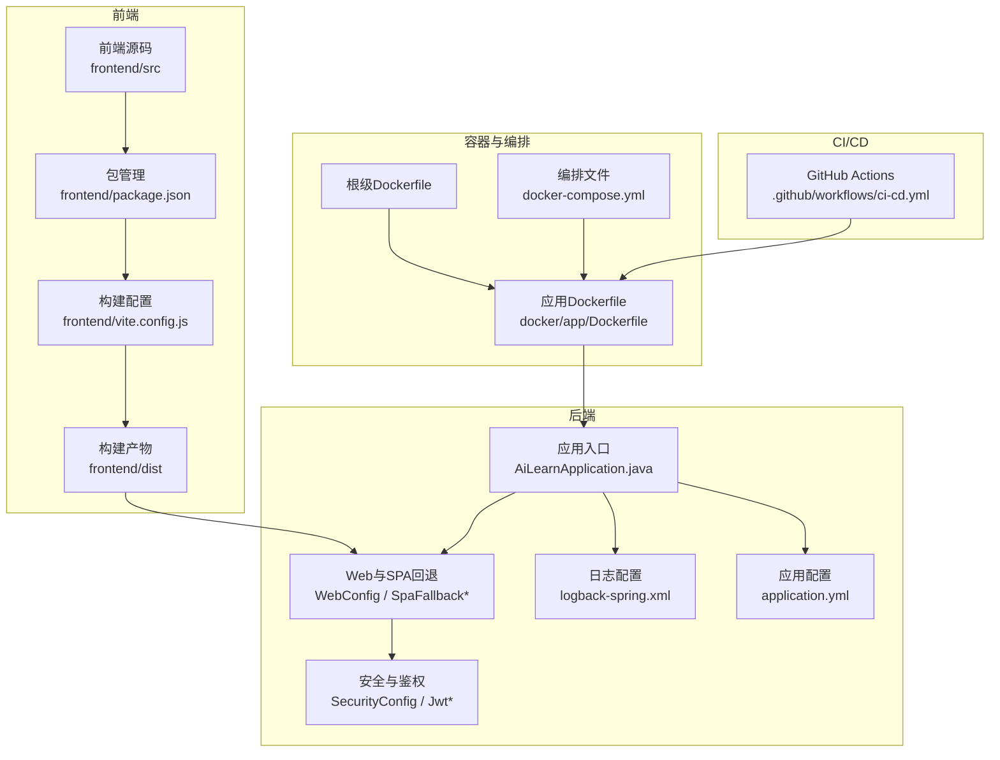
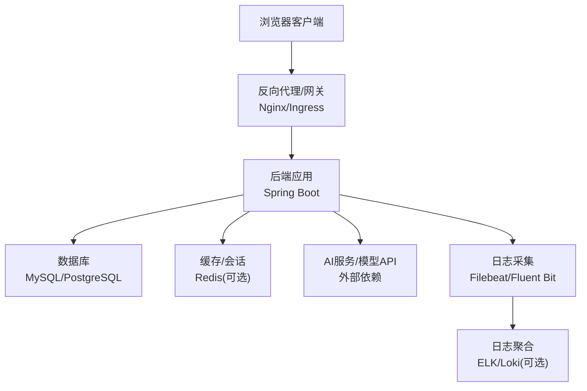
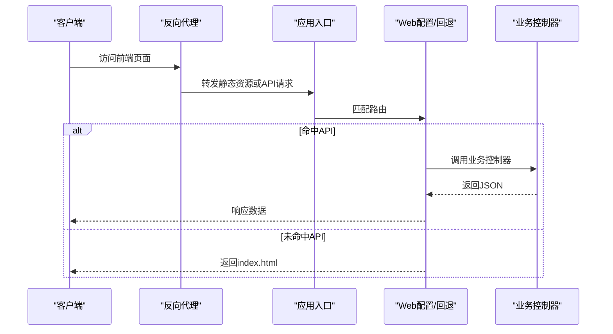
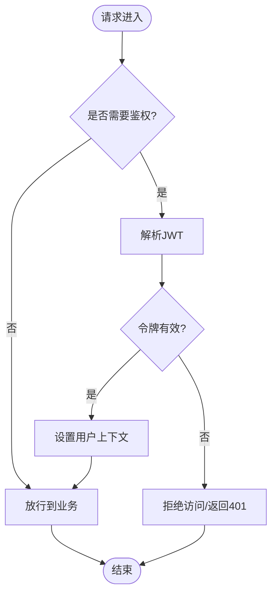
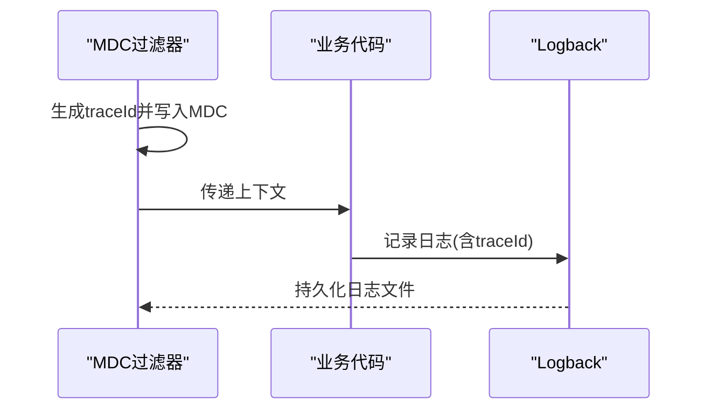
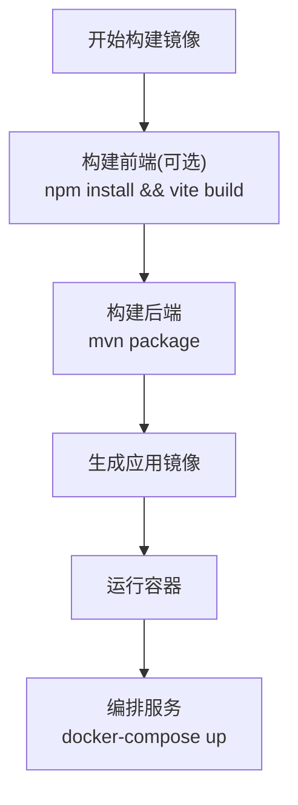
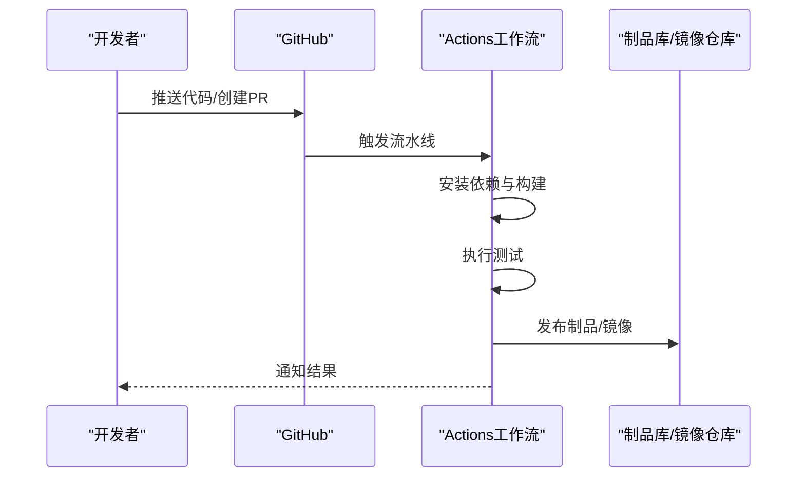
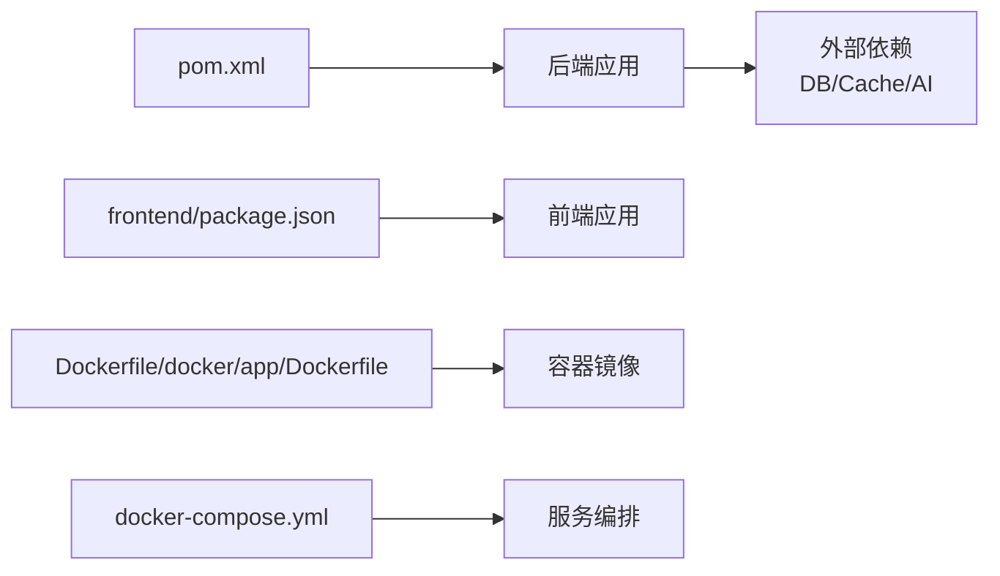

# 部署指南

<cite>
**本文引用的文件**   
- [pom.xml](file://pom.xml)
- [src/main/resources/application.yml](file://src/main/resources/application.yml)
- [src/main/resources/logback-spring.xml](file://src/main/resources/logback-spring.xml)
- [src/main/java/com/ailearn/AiLearnApplication.java](file://src/main/java/com/ailearn/AiLearnApplication.java)
- [src/main/java/com/ailearn/config/WebConfig.java](file://src/main/java/com/ailearn/config/WebConfig.java)
- [src/main/java/com/ailearn/config/SpaFallbackController.java](file://src/main/java/com/ailearn/config/SpaFallbackController.java)
- [src/main/java/com/ailearn/config/SpaFallbackFilter.java](file://src/main/java/com/ailearn/config/SpaFallbackFilter.java)
- [src/main/java/com/ailearn/security/JwtAuthenticationFilter.java](file://src/main/java/com/ailearn/security/JwtAuthenticationFilter.java)
- [src/main/java/com/ailearn/security/JwtUtil.java](file://src/main/java/com/ailearn/security/JwtUtil.java)
- [src/main/java/com/ailearn/config/MdcTraceFilter.java](file://src/main/java/com/ailearn/config/MdcTraceFilter.java)
- [src/main/java/com/ailearn/common/GlobalExceptionHandler.java](file://src/main/java/com/ailearn/common/GlobalExceptionHandler.java)
- [frontend/package.json](file://frontend/package.json)
- [frontend/vite.config.js](file://frontend/vite.config.js)
- [Dockerfile](file://Dockerfile)
- [docker/app/Dockerfile](file://docker/app/Dockerfile)
- [docker-compose.yml](file://docker-compose.yml)
- [.github/workflows/ci-cd.yml](file://.github/workflows/ci-cd.yml)
- [docs/DEPLOYMENT.md](file://docs/DEPLOYMENT.md)
</cite>

## 目录
1. [简介](#简介)
2. [项目结构](#项目结构)
3. [核心组件](#核心组件)
4. [架构总览](#架构总览)
5. [详细组件分析](#详细组件分析)
6. [依赖分析](#依赖分析)
7. [性能考虑](#性能考虑)
8. [故障排查指南](#故障排查指南)
9. [结论](#结论)
10. [附录](#附录)

## 简介
本指南面向Java AI学习平台的部署与运维，覆盖本地开发、容器化与编排、生产环境部署、CI/CD流水线、环境变量与敏感信息管理、负载均衡与高可用、监控日志收集、性能调优与资源规划、故障排查与回滚策略，以及主流云平台的适配要点。文档以仓库现有配置为依据，提供可操作的步骤与最佳实践建议。

## 项目结构
本项目采用前后端分离的架构：
- 后端：Spring Boot应用，包含AI对话、RAG、记忆、结构化输出、MCP工具等能力；内置静态资源与SPA回退逻辑；集成JWT鉴权、限流、OpenAPI、MyBatis Plus等。
- 前端：Vue + Vite构建，打包产物位于dist目录，由后端静态资源服务或反向代理统一提供。
- 容器化：根级Dockerfile与docker/app/Dockerfile两种镜像构建方式；提供docker-compose用于本地一键编排。
- CI/CD：GitHub Actions工作流定义构建、测试与镜像发布流程。
- 文档：docs/DEPLOYMENT.md提供部署相关说明。

图表来源
- [src/main/java/com/ailearn/AiLearnApplication.java](file://src/main/java/com/ailearn/AiLearnApplication.java)
- [src/main/java/com/ailearn/config/WebConfig.java](file://src/main/java/com/ailearn/config/WebConfig.java)
- [src/main/java/com/ailearn/config/SpaFallbackController.java](file://src/main/java/com/ailearn/config/SpaFallbackController.java)
- [src/main/java/com/ailearn/config/SpaFallbackFilter.java](file://src/main/java/com/ailearn/config/SpaFallbackFilter.java)
- [src/main/java/com/ailearn/security/JwtAuthenticationFilter.java](file://src/main/java/com/ailearn/security/JwtAuthenticationFilter.java)
- [src/main/java/com/ailearn/security/JwtUtil.java](file://src/main/java/com/ailearn/security/JwtUtil.java)
- [src/main/resources/logback-spring.xml](file://src/main/resources/logback-spring.xml)
- [src/main/resources/application.yml](file://src/main/resources/application.yml)
- [frontend/package.json](file://frontend/package.json)
- [frontend/vite.config.js](file://frontend/vite.config.js)
- [Dockerfile](file://Dockerfile)
- [docker/app/Dockerfile](file://docker/app/Dockerfile)
- [docker-compose.yml](file://docker-compose.yml)
- [.github/workflows/ci-cd.yml](file://.github/workflows/ci-cd.yml)

章节来源
- [src/main/java/com/ailearn/AiLearnApplication.java](file://src/main/java/com/ailearn/AiLearnApplication.java)
- [src/main/resources/application.yml](file://src/main/resources/application.yml)
- [src/main/resources/logback-spring.xml](file://src/main/resources/logback-spring.xml)
- [frontend/package.json](file://frontend/package.json)
- [frontend/vite.config.js](file://frontend/vite.config.js)
- [Dockerfile](file://Dockerfile)
- [docker/app/Dockerfile](file://docker/app/Dockerfile)
- [docker-compose.yml](file://docker-compose.yml)
- [.github/workflows/ci-cd.yml](file://.github/workflows/ci-cd.yml)
- [docs/DEPLOYMENT.md](file://docs/DEPLOYMENT.md)

## 核心组件
- 应用入口与启动：Spring Boot主类负责初始化应用上下文、加载配置、注册过滤器与控制器。
- Web与SPA支持：Web配置与回退控制器/过滤器确保前端路由在浏览器刷新时正确返回index.html。
- 安全与鉴权：基于JWT的认证过滤器与工具类，实现请求校验与用户上下文注入。
- 日志与追踪：Logback配置与MDC链路追踪过滤器，便于问题定位与审计。
- 全局异常处理：统一异常捕获与响应封装，提升用户体验与稳定性。
- 前端构建：Vite构建脚本与包管理，生成静态资源供后端或反向代理提供服务。

章节来源
- [src/main/java/com/ailearn/AiLearnApplication.java](file://src/main/java/com/ailearn/AiLearnApplication.java)
- [src/main/java/com/ailearn/config/WebConfig.java](file://src/main/java/com/ailearn/config/WebConfig.java)
- [src/main/java/com/ailearn/config/SpaFallbackController.java](file://src/main/java/com/ailearn/config/SpaFallbackController.java)
- [src/main/java/com/ailearn/config/SpaFallbackFilter.java](file://src/main/java/com/ailearn/config/SpaFallbackFilter.java)
- [src/main/java/com/ailearn/security/JwtAuthenticationFilter.java](file://src/main/java/com/ailearn/security/JwtAuthenticationFilter.java)
- [src/main/java/com/ailearn/security/JwtUtil.java](file://src/main/java/com/ailearn/security/JwtUtil.java)
- [src/main/java/com/ailearn/config/MdcTraceFilter.java](file://src/main/java/com/ailearn/config/MdcTraceFilter.java)
- [src/main/java/com/ailearn/common/GlobalExceptionHandler.java](file://src/main/java/com/ailearn/common/GlobalExceptionHandler.java)
- [src/main/resources/logback-spring.xml](file://src/main/resources/logback-spring.xml)
- [frontend/package.json](file://frontend/package.json)
- [frontend/vite.config.js](file://frontend/vite.config.js)

## 架构总览
整体架构分为四层：客户端（浏览器）、反向代理/网关（可选）、后端应用（Spring Boot）、外部依赖（数据库、对象存储、AI服务等）。容器化后通过编排工具进行多实例部署与扩展。

[此图为概念性架构图，不直接映射具体源文件]

## 详细组件分析

### 应用启动与Web层
- 启动流程：主类加载配置、初始化Bean、注册过滤器与拦截器、暴露HTTP端口。
- SPA回退：对未匹配到控制器的请求，回退至前端index.html，保证前端路由正常工作。
- 静态资源：将前端dist目录作为静态资源提供，或通过反向代理独立托管。

图表来源
- [src/main/java/com/ailearn/AiLearnApplication.java](file://src/main/java/com/ailearn/AiLearnApplication.java)
- [src/main/java/com/ailearn/config/WebConfig.java](file://src/main/java/com/ailearn/config/WebConfig.java)
- [src/main/java/com/ailearn/config/SpaFallbackController.java](file://src/main/java/com/ailearn/config/SpaFallbackController.java)
- [src/main/java/com/ailearn/config/SpaFallbackFilter.java](file://src/main/java/com/ailearn/config/SpaFallbackFilter.java)

章节来源
- [src/main/java/com/ailearn/AiLearnApplication.java](file://src/main/java/com/ailearn/AiLearnApplication.java)
- [src/main/java/com/ailearn/config/WebConfig.java](file://src/main/java/com/ailearn/config/WebConfig.java)
- [src/main/java/com/ailearn/config/SpaFallbackController.java](file://src/main/java/com/ailearn/config/SpaFallbackController.java)
- [src/main/java/com/ailearn/config/SpaFallbackFilter.java](file://src/main/java/com/ailearn/config/SpaFallbackFilter.java)

### 安全与鉴权
- JWT过滤器：在请求进入业务前解析并验证令牌，设置用户上下文。
- 工具类：提供令牌生成、校验与过期处理。
- 安全配置：定义受保护路径与放行规则。

图表来源
- [src/main/java/com/ailearn/security/JwtAuthenticationFilter.java](file://src/main/java/com/ailearn/security/JwtAuthenticationFilter.java)
- [src/main/java/com/ailearn/security/JwtUtil.java](file://src/main/java/com/ailearn/security/JwtUtil.java)

章节来源
- [src/main/java/com/ailearn/security/JwtAuthenticationFilter.java](file://src/main/java/com/ailearn/security/JwtAuthenticationFilter.java)
- [src/main/java/com/ailearn/security/JwtUtil.java](file://src/main/java/com/ailearn/security/JwtUtil.java)

### 日志与链路追踪
- MDC过滤器：为每个请求注入traceId，贯穿日志输出，便于跨服务关联。
- Logback配置：按级别与模块输出日志，支持滚动与归档。

图表来源
- [src/main/java/com/ailearn/config/MdcTraceFilter.java](file://src/main/java/com/ailearn/config/MdcTraceFilter.java)
- [src/main/resources/logback-spring.xml](file://src/main/resources/logback-spring.xml)

章节来源
- [src/main/java/com/ailearn/config/MdcTraceFilter.java](file://src/main/java/com/ailearn/config/MdcTraceFilter.java)
- [src/main/resources/logback-spring.xml](file://src/main/resources/logback-spring.xml)

### 全局异常处理
- 统一捕获运行时与业务异常，转换为标准响应体，避免泄露内部错误信息。
- 结合日志输出关键上下文，辅助快速定位问题。

章节来源
- [src/main/java/com/ailearn/common/GlobalExceptionHandler.java](file://src/main/java/com/ailearn/common/GlobalExceptionHandler.java)

### 前端构建与静态资源
- 使用Vite进行开发与构建，package.json定义依赖与脚本，vite.config.js配置构建选项。
- 构建产物dist目录可由后端静态资源服务提供，也可由Nginx独立托管并通过反向代理转发API。

章节来源
- [frontend/package.json](file://frontend/package.json)
- [frontend/vite.config.js](file://frontend/vite.config.js)

### 容器镜像与编排
- 根级Dockerfile与docker/app/Dockerfile提供两种镜像构建方式，推荐在多阶段构建中优先选择更精简的基础镜像。
- docker-compose用于本地一键拉起应用与依赖（如数据库），适合开发与演示环境。

图表来源
- [Dockerfile](file://Dockerfile)
- [docker/app/Dockerfile](file://docker/app/Dockerfile)
- [docker-compose.yml](file://docker-compose.yml)

章节来源
- [Dockerfile](file://Dockerfile)
- [docker/app/Dockerfile](file://docker/app/Dockerfile)
- [docker-compose.yml](file://docker-compose.yml)

### CI/CD流水线
- GitHub Actions工作流定义自动化构建、测试与镜像发布流程，支持分支触发与条件发布。
- 建议在流水线中集成安全扫描、制品归档与版本标签管理。

图表来源
- [.github/workflows/ci-cd.yml](file://.github/workflows/ci-cd.yml)

章节来源
- [.github/workflows/ci-cd.yml](file://.github/workflows/ci-cd.yml)

## 依赖分析
- 构建依赖：pom.xml定义后端依赖与插件；frontend/package.json定义前端依赖与脚本。
- 运行时依赖：数据库、缓存、AI服务接口等外部系统，通过配置文件注入连接参数。
- 容器依赖：Dockerfile与docker-compose声明基础镜像与服务编排关系。

图表来源
- [pom.xml](file://pom.xml)
- [frontend/package.json](file://frontend/package.json)
- [Dockerfile](file://Dockerfile)
- [docker/app/Dockerfile](file://docker/app/Dockerfile)
- [docker-compose.yml](file://docker-compose.yml)

章节来源
- [pom.xml](file://pom.xml)
- [frontend/package.json](file://frontend/package.json)
- [Dockerfile](file://Dockerfile)
- [docker/app/Dockerfile](file://docker/app/Dockerfile)
- [docker-compose.yml](file://docker-compose.yml)

## 性能考虑
- JVM与容器：根据容器限制合理设置JVM堆大小与GC策略，避免OOM与频繁回收。
- 线程池与连接池：调整Tomcat线程数、数据库连接池大小，匹配并发与延迟目标。
- 缓存与会话：引入缓存减少热点查询压力，会话集中存储便于水平扩展。
- 静态资源：将前端静态资源交由高性能CDN或Nginx托管，降低后端负载。
- 限流与熔断：对AI接口与外部依赖增加限流与熔断保护，防止雪崩。
- 日志级别：生产环境降低日志级别，仅保留必要告警与关键路径日志。

[本节为通用指导，不直接分析具体文件]

## 故障排查指南
- 启动失败：检查应用配置、端口占用、依赖服务连通性与权限。
- 鉴权异常：核对JWT密钥、令牌有效期与签名算法一致性。
- 静态资源404：确认前端构建产物路径与静态资源映射是否正确。
- 日志缺失：检查MDC过滤器是否生效、Logback输出路径与权限。
- 性能瓶颈：观察CPU/内存/IO指标，定位慢SQL与外部依赖超时。
- 回滚策略：基于镜像版本标签与编排文件进行灰度或蓝绿切换，保留旧版本快照以便快速回滚。

章节来源
- [src/main/resources/application.yml](file://src/main/resources/application.yml)
- [src/main/resources/logback-spring.xml](file://src/main/resources/logback-spring.xml)
- [src/main/java/com/ailearn/config/MdcTraceFilter.java](file://src/main/java/com/ailearn/config/MdcTraceFilter.java)
- [src/main/java/com/ailearn/security/JwtAuthenticationFilter.java](file://src/main/java/com/ailearn/security/JwtAuthenticationFilter.java)
- [src/main/java/com/ailearn/config/SpaFallbackController.java](file://src/main/java/com/ailearn/config/SpaFallbackController.java)

## 结论
本指南围绕Java AI学习平台提供了从本地开发到生产环境的完整部署方案，涵盖容器化、编排、CI/CD、安全、日志、性能与运维要点。建议在生产环境中采用反向代理+多实例+外部依赖集群的高可用架构，配合完善的监控与告警体系，保障系统稳定与可观测性。

[本节为总结性内容，不直接分析具体文件]

## 附录

### 本地开发环境
- 前置条件：JDK、Maven、Node.js、数据库。
- 步骤：
  - 安装依赖并构建前端：参考前端包管理与构建脚本。
  - 配置数据库与应用参数：参考应用配置文件。
  - 启动后端应用：运行主类或使用Maven插件。
  - 访问前端：默认静态资源由后端提供或通过反向代理。

章节来源
- [frontend/package.json](file://frontend/package.json)
- [frontend/vite.config.js](file://frontend/vite.config.js)
- [src/main/resources/application.yml](file://src/main/resources/application.yml)
- [src/main/java/com/ailearn/AiLearnApplication.java](file://src/main/java/com/ailearn/AiLearnApplication.java)

### Docker容器化部署
- 镜像构建：
  - 使用根级Dockerfile或docker/app/Dockerfile进行构建。
  - 推荐多阶段构建，减小镜像体积。
- 容器运行：
  - 通过docker run或docker-compose启动，挂载配置与日志目录。
  - 设置必要的环境变量（数据库、AI服务、JWT密钥等）。
- 编排示例：
  - 使用docker-compose定义应用与依赖服务，便于本地与测试环境快速拉起。

章节来源
- [Dockerfile](file://Dockerfile)
- [docker/app/Dockerfile](file://docker/app/Dockerfile)
- [docker-compose.yml](file://docker-compose.yml)
- [src/main/resources/application.yml](file://src/main/resources/application.yml)

### 生产环境部署
- 反向代理：使用Nginx或云厂商网关进行HTTPS终止、静态资源托管与API转发。
- 多实例与扩缩容：基于容器编排（Kubernetes）或云平台托管服务进行水平扩展。
- 外部依赖：数据库主从/集群、缓存集群、消息队列与对象存储按需接入。
- 安全加固：最小权限原则、网络隔离、密钥管理与证书轮换。

[本节为通用指导，不直接分析具体文件]

### CI/CD流水线配置
- 触发条件：分支推送、Pull Request、标签发布。
- 任务阶段：依赖安装、构建、测试、安全扫描、制品归档、镜像发布。
- 环境管理：区分开发、测试、生产环境，使用不同配置与凭据。
- 回滚机制：基于版本标签与编排文件进行快速回滚。

章节来源
- [.github/workflows/ci-cd.yml](file://.github/workflows/ci-cd.yml)

### 环境变量与敏感信息管理
- 环境变量：数据库连接、AI服务地址、JWT密钥、日志级别等通过环境变量注入。
- 敏感信息：使用密钥管理服务（如KMS、Vault、云平台Secrets Manager）注入，避免硬编码。
- 配置分层：开发、测试、生产环境分别维护配置，遵循最小披露原则。

[本节为通用指导，不直接分析具体文件]

### 负载均衡与高可用
- 负载均衡：反向代理或云网关分发流量，健康检查与故障转移。
- 无状态设计：会话与缓存外置，便于水平扩展。
- 多可用区：跨可用区部署，提升容灾能力。
- 数据备份：数据库定期备份与恢复演练。

[本节为通用指导，不直接分析具体文件]

### 监控与日志收集
- 指标采集：应用指标、系统指标、业务指标统一上报。
- 日志收集：Filebeat/Fluent Bit采集容器日志，汇聚至ELK/Loki。
- 告警规则：基于阈值与异常模式设置告警，及时通知运维团队。
- 链路追踪：结合MDC与分布式追踪工具，定位跨服务问题。

[本节为通用指导，不直接分析具体文件]

### 性能调优与资源规划
- JVM调优：堆大小、GC策略、元空间与线程栈优化。
- 连接池：数据库与HTTP客户端连接池大小与超时配置。
- 缓存策略：热点数据缓存与失效策略。
- 容量规划：根据QPS与延迟目标评估CPU/内存/带宽需求。

[本节为通用指导，不直接分析具体文件]

### 故障排查与回滚策略
- 快速定位：利用traceId与日志聚合快速定位问题。
- 降级与熔断：对外部依赖进行熔断与降级，保障核心功能可用。
- 灰度发布：逐步放量新版本，观察指标与错误率。
- 回滚流程：停止新版本，恢复旧版本镜像与配置，验证服务可用性。

[本节为通用指导，不直接分析具体文件]

### 云平台部署适配
- 阿里云：使用ACK（Kubernetes）或SAE（Serverless应用引擎），结合SLB与RDS。
- 腾讯云：使用TKE或SCF，结合CLB与TencentDB。
- AWS：使用EKS或App Runner，结合ALB与RDS。
- Azure：使用AKS或Container Apps，结合Azure Load Balancer与Azure Database。

[本节为通用指导，不直接分析具体文件]