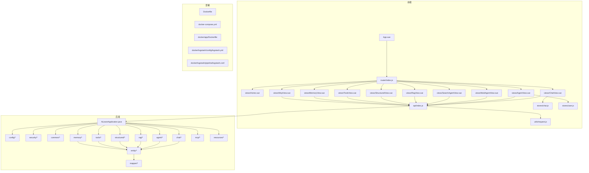
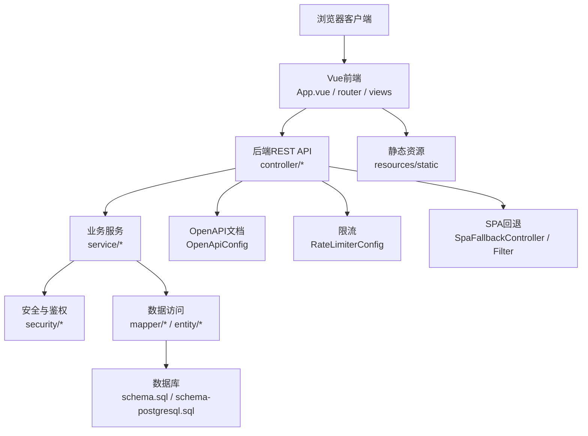
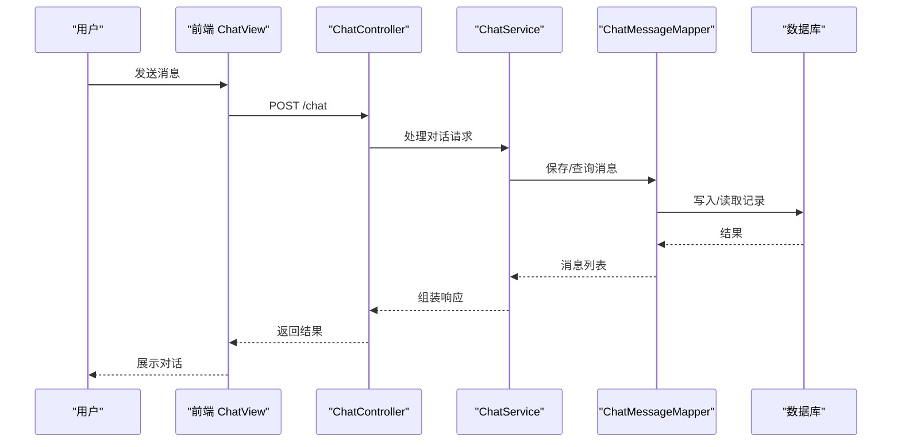
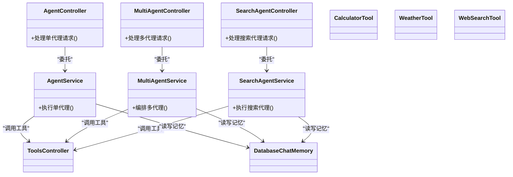
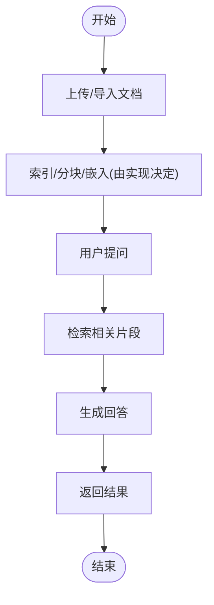
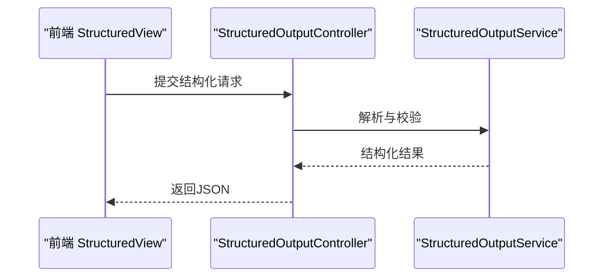
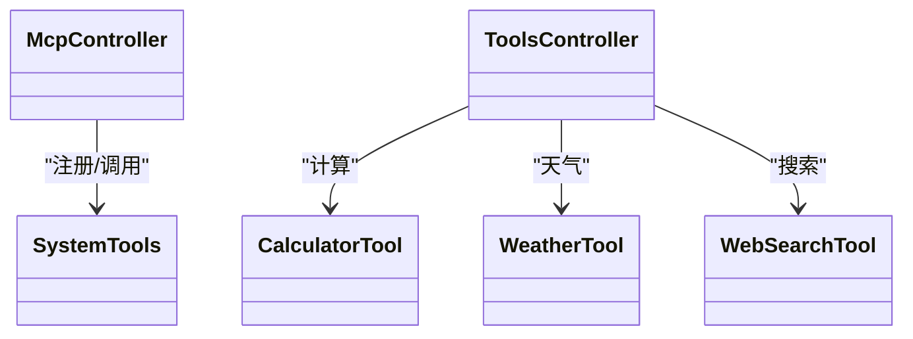
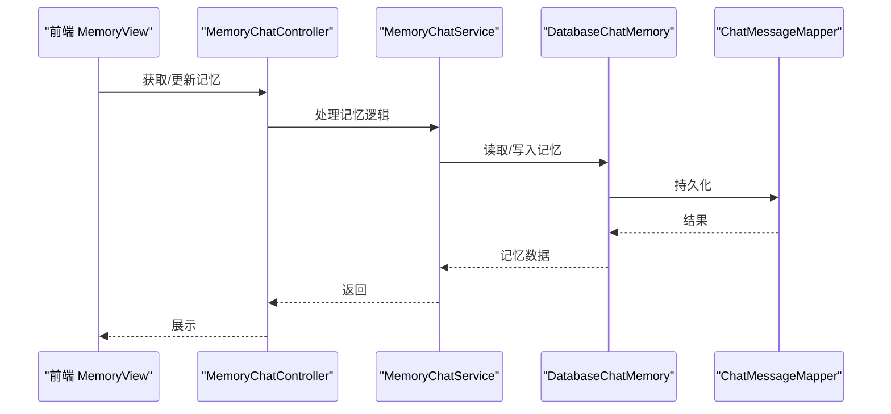
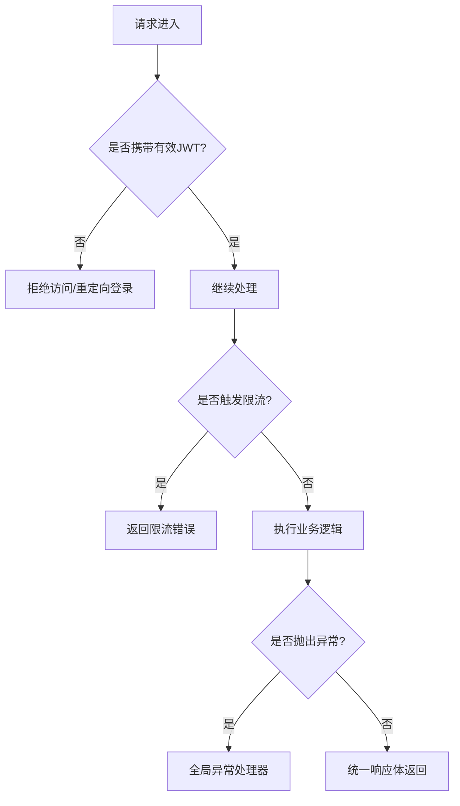
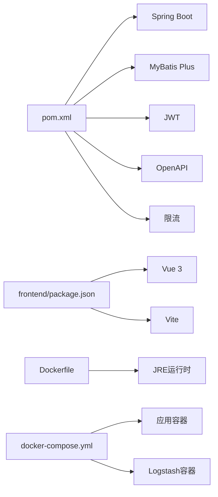

# 项目概述

<cite>
**本文引用的文件**   
- [pom.xml](file://pom.xml)
- [src/main/java/com/ailearn/AiLearnApplication.java](file://src/main/java/com/ailearn/AiLearnApplication.java)
- [src/main/resources/application.yml](file://src/main/resources/application.yml)
- [src/main/resources/schema.sql](file://src/main/resources/schema.sql)
- [src/main/resources/schema-postgresql.sql](file://src/main/resources/schema-postgresql.sql)
- [src/main/java/com/ailearn/config/WebConfig.java](file://src/main/java/com/ailearn/config/WebConfig.java)
- [src/main/java/com/ailearn/config/SpaFallbackController.java](file://src/main/java/com/ailearn/config/SpaFallbackController.java)
- [src/main/java/com/ailearn/config/SpaFallbackFilter.java](file://src/main/java/com/ailearn/config/SpaFallbackFilter.java)
- [src/main/java/com/ailearn/config/OpenApiConfig.java](file://src/main/java/com/ailearn/config/OpenApiConfig.java)
- [src/main/java/com/ailearn/config/RateLimiterConfig.java](file://src/main/java/com/ailearn/config/RateLimiterConfig.java)
- [src/main/java/com/ailearn/config/McpServerConfig.java](file://src/main/java/com/ailearn/config/McpServerConfig.java)
- [src/main/java/com/ailearn/config/MyBatisPlusConfig.java](file://src/main/java/com/ailearn/config/MyBatisPlusConfig.java)
- [src/main/java/com/ailearn/chat/ChatController.java](file://src/main/java/com/ailearn/chat/ChatController.java)
- [src/main/java/com/ailearn/chat/ChatService.java](file://src/main/java/com/ailearn/chat/ChatService.java)
- [src/main/java/com/ailearn/agent/AgentController.java](file://src/main/java/com/ailearn/agent/AgentController.java)
- [src/main/java/com/ailearn/agent/AgentService.java](file://src/main/java/com/ailearn/agent/AgentService.java)
- [src/main/java/com/ailearn/agent/MultiAgentController.java](file://src/main/java/com/ailearn/agent/MultiAgentController.java)
- [src/main/java/com/ailearn/agent/MultiAgentService.java](file://src/main/java/com/ailearn/agent/MultiAgentService.java)
- [src/main/java/com/ailearn/agent/SearchAgentController.java](file://src/main/java/com/ailearn/agent/SearchAgentController.java)
- [src/main/java/com/ailearn/agent/SearchAgentService.java](file://src/main/java/com/ailearn/agent/SearchAgentService.java)
- [src/main/java/com/ailearn/rag/RagController.java](file://src/main/java/com/ailearn/rag/RagController.java)
- [src/main/java/com/ailearn/rag/RagService.java](file://src/main/java/com/ailearn/rag/RagService.java)
- [src/main/java/com/ailearn/structured/StructuredOutputController.java](file://src/main/java/com/ailearn/structured/StructuredOutputController.java)
- [src/main/java/com/ailearn/structured/StructuredOutputService.java](file://src/main/java/com/ailearn/structured/StructuredOutputService.java)
- [src/main/java/com/ailearn/tools/ToolsController.java](file://src/main/java/com/ailearn/tools/ToolsController.java)
- [src/main/java/com/ailearn/tools/CalculatorTool.java](file://src/main/java/com/ailearn/tools/CalculatorTool.java)
- [src/main/java/com/ailearn/tools/WeatherTool.java](file://src/main/java/com/ailearn/tools/WeatherTool.java)
- [src/main/java/com/ailearn/tools/WebSearchTool.java](file://src/main/java/com/ailearn/tools/WebSearchTool.java)
- [src/main/java/com/ailearn/mcp/McpController.java](file://src/main/java/com/ailearn/mcp/McpController.java)
- [src/main/java/com/ailearn/mcp/SystemTools.java](file://src/main/java/com/ailearn/mcp/SystemTools.java)
- [src/main/java/com/ailearn/memory/MemoryChatController.java](file://src/main/java/com/ailearn/memory/MemoryChatController.java)
- [src/main/java/com/ailearn/memory/MemoryChatService.java](file://src/main/java/com/ailearn/memory/MemoryChatService.java)
- [src/main/java/com/ailearn/memory/DatabaseChatMemory.java](file://src/main/java/com/ailearn/memory/DatabaseChatMemory.java)
- [src/main/java/com/ailearn/security/JwtAuthenticationFilter.java](file://src/main/java/com/ailearn/security/JwtAuthenticationFilter.java)
- [src/main/java/com/ailearn/security/JwtUtil.java](file://src/main/java/com/ailearn/security/JwtUtil.java)
- [src/main/java/com/ailearn/security/SecurityConfig.java](file://src/main/java/com/ailearn/security/SecurityConfig.java)
- [src/main/java/com/ailearn/security/UserPrincipal.java](file://src/main/java/com/ailearn/security/UserPrincipal.java)
- [src/main/java/com/ailearn/common/Result.java](file://src/main/java/com/ailearn/common/Result.java)
- [src/main/java/com/ailearn/common/GlobalExceptionHandler.java](file://src/main/java/com/ailearn/common/GlobalExceptionHandler.java)
- [src/main/java/com/ailearn/entity/ChatMessage.java](file://src/main/java/com/ailearn/entity/ChatMessage.java)
- [src/main/java/com/ailearn/entity/Conversation.java](file://src/main/java/com/ailearn/entity/Conversation.java)
- [src/main/java/com/ailearn/entity/RagDocument.java](file://src/main/java/com/ailearn/entity/RagDocument.java)
- [src/main/java/com/ailearn/entity/User.java](file://src/main/java/com/ailearn/entity/User.java)
- [src/main/java/com/ailearn/mapper/ChatMessageMapper.java](file://src/main/java/com/ailearn/mapper/ChatMessageMapper.java)
- [src/main/java/com/ailearn/mapper/ConversationMapper.java](file://src/main/java/com/ailearn/mapper/ConversationMapper.java)
- [src/main/java/com/ailearn/mapper/RagDocumentMapper.java](file://src/main/java/com/ailearn/mapper/RagDocumentMapper.java)
- [src/main/java/com/ailearn/mapper/UserMapper.java](file://src/main/java/com/ailearn/mapper/UserMapper.java)
- [frontend/src/App.vue](file://frontend/src/App.vue)
- [frontend/src/router/index.js](file://frontend/src/router/index.js)
- [frontend/src/views/Home.vue](file://frontend/src/views/Home.vue)
- [frontend/src/views/ChatView.vue](file://frontend/src/views/ChatView.vue)
- [frontend/src/views/AgentView.vue](file://frontend/src/views/AgentView.vue)
- [frontend/src/views/MultiAgentView.vue](file://frontend/src/views/MultiAgentView.vue)
- [frontend/src/views/SearchAgentView.vue](file://frontend/src/views/SearchAgentView.vue)
- [frontend/src/views/RagView.vue](file://frontend/src/views/RagView.vue)
- [frontend/src/views/StructuredView.vue](file://frontend/src/views/StructuredView.vue)
- [frontend/src/views/ToolsView.vue](file://frontend/src/views/ToolsView.vue)
- [frontend/src/views/MemoryView.vue](file://frontend/src/views/MemoryView.vue)
- [frontend/src/views/McpView.vue](file://frontend/src/views/McpView.vue)
- [frontend/src/api/index.js](file://frontend/src/api/index.js)
- [frontend/src/utils/request.js](file://frontend/src/utils/request.js)
- [frontend/src/stores/chat.js](file://frontend/src/stores/chat.js)
- [frontend/src/stores/user.js](file://frontend/src/stores/user.js)
- [frontend/package.json](file://frontend/package.json)
- [frontend/vite.config.js](file://frontend/vite.config.js)
- [Dockerfile](file://Dockerfile)
- [docker-compose.yml](file://docker-compose.yml)
- [docker/app/Dockerfile](file://docker/app/Dockerfile)
- [docker/logstash/config/logstash.yml](file://docker/logstash/config/logstash.yml)
- [docker/logstash/pipeline/logstash.conf](file://docker/logstash/pipeline/logstash.conf)
- [docs/DEPLOYMENT.md](file://docs/DEPLOYMENT.md)
</cite>

## 目录
1. [简介](#简介)
2. [项目结构](#项目结构)
3. [核心组件](#核心组件)
4. [架构总览](#架构总览)
5. [详细组件分析](#详细组件分析)
6. [依赖分析](#依赖分析)
7. [性能考虑](#性能考虑)
8. [故障排查指南](#故障排查指南)
9. [结论](#结论)
10. [附录](#附录)

## 简介
本项目是一个面向AI学习的Java平台，围绕“对话、智能代理、RAG知识库、结构化输出、工具系统”等能力构建，提供前后端分离的Web体验与容器化部署能力。后端基于Spring Boot生态，前端采用Vue.js + Vite，数据层支持多种数据库（通过配置切换），并内置JWT鉴权、限流、OpenAPI文档、MCP集成等工程化特性，适合初学者快速上手AI应用开发，也具备向微服务演进的基础。

## 项目结构
整体采用前后端分离：
- 后端：Spring Boot单体应用，按领域分层组织（controller/service/mapper/entity/dto），并提供安全、配置、异常处理等横切能力。
- 前端：Vue 3 + Vite，路由与视图按功能域划分，状态管理使用轻量store，统一HTTP封装。
- 部署：提供Docker镜像构建与docker-compose编排，便于本地与生产环境一键启动。

图表来源
- [src/main/java/com/ailearn/AiLearnApplication.java](file://src/main/java/com/ailearn/AiLearnApplication.java)
- [src/main/resources/application.yml](file://src/main/resources/application.yml)
- [frontend/src/App.vue](file://frontend/src/App.vue)
- [frontend/src/router/index.js](file://frontend/src/router/index.js)
- [frontend/src/api/index.js](file://frontend/src/api/index.js)
- [frontend/src/utils/request.js](file://frontend/src/utils/request.js)
- [frontend/src/stores/chat.js](file://frontend/src/stores/chat.js)
- [frontend/src/stores/user.js](file://frontend/src/stores/user.js)
- [Dockerfile](file://Dockerfile)
- [docker-compose.yml](file://docker-compose.yml)
- [docker/app/Dockerfile](file://docker/app/Dockerfile)
- [docker/logstash/config/logstash.yml](file://docker/logstash/config/logstash.yml)
- [docker/logstash/pipeline/logstash.conf](file://docker/logstash/pipeline/logstash.conf)

章节来源
- [src/main/java/com/ailearn/AiLearnApplication.java](file://src/main/java/com/ailearn/AiLearnApplication.java)
- [src/main/resources/application.yml](file://src/main/resources/application.yml)
- [frontend/src/App.vue](file://frontend/src/App.vue)
- [frontend/src/router/index.js](file://frontend/src/router/index.js)
- [frontend/src/api/index.js](file://frontend/src/api/index.js)
- [frontend/src/utils/request.js](file://frontend/src/utils/request.js)
- [frontend/src/stores/chat.js](file://frontend/src/stores/chat.js)
- [frontend/src/stores/user.js](file://frontend/src/stores/user.js)
- [Dockerfile](file://Dockerfile)
- [docker-compose.yml](file://docker-compose.yml)
- [docker/app/Dockerfile](file://docker/app/Dockerfile)
- [docker/logstash/config/logstash.yml](file://docker/logstash/config/logstash.yml)
- [docker/logstash/pipeline/logstash.conf](file://docker/logstash/pipeline/logstash.conf)

## 核心组件
- AI对话系统
  - 提供基础对话接口与持久化会话消息，支持多轮上下文。
  - 关键路径：控制器与服务层解耦，实体与映射器负责数据访问。
- 智能代理框架
  - 单代理、多代理与搜索代理三种形态，分别对应不同任务编排与检索增强场景。
- RAG知识库
  - 文档入库、检索召回与生成式问答链路，结合向量或关键词检索（由实现决定）。
- 结构化输出
  - 将模型输出约束为结构化JSON，便于下游系统集成。
- 工具系统
  - 计算器、天气、网页搜索等工具，供代理在推理过程中调用。
- MCP集成
  - 暴露系统工具与MCP控制器，便于外部系统接入。
- 记忆与会话
  - 基于数据库的聊天记忆，支撑跨请求的上下文保持。
- 安全与通用能力
  - JWT鉴权过滤器与工具类、全局异常处理、统一响应体、限流、OpenAPI文档、SPA回退等。

章节来源
- [src/main/java/com/ailearn/chat/ChatController.java](file://src/main/java/com/ailearn/chat/ChatController.java)
- [src/main/java/com/ailearn/chat/ChatService.java](file://src/main/java/com/ailearn/chat/ChatService.java)
- [src/main/java/com/ailearn/agent/AgentController.java](file://src/main/java/com/ailearn/agent/AgentController.java)
- [src/main/java/com/ailearn/agent/AgentService.java](file://src/main/java/com/ailearn/agent/AgentService.java)
- [src/main/java/com/ailearn/agent/MultiAgentController.java](file://src/main/java/com/ailearn/agent/MultiAgentController.java)
- [src/main/java/com/ailearn/agent/MultiAgentService.java](file://src/main/java/com/ailearn/agent/MultiAgentService.java)
- [src/main/java/com/ailearn/agent/SearchAgentController.java](file://src/main/java/com/ailearn/agent/SearchAgentController.java)
- [src/main/java/com/ailearn/agent/SearchAgentService.java](file://src/main/java/com/ailearn/agent/SearchAgentService.java)
- [src/main/java/com/ailearn/rag/RagController.java](file://src/main/java/com/ailearn/rag/RagController.java)
- [src/main/java/com/ailearn/rag/RagService.java](file://src/main/java/com/ailearn/rag/RagService.java)
- [src/main/java/com/ailearn/structured/StructuredOutputController.java](file://src/main/java/com/ailearn/structured/StructuredOutputController.java)
- [src/main/java/com/ailearn/structured/StructuredOutputService.java](file://src/main/java/com/ailearn/structured/StructuredOutputService.java)
- [src/main/java/com/ailearn/tools/ToolsController.java](file://src/main/java/com/ailearn/tools/ToolsController.java)
- [src/main/java/com/ailearn/tools/CalculatorTool.java](file://src/main/java/com/ailearn/tools/CalculatorTool.java)
- [src/main/java/com/ailearn/tools/WeatherTool.java](file://src/main/java/com/ailearn/tools/WeatherTool.java)
- [src/main/java/com/ailearn/tools/WebSearchTool.java](file://src/main/java/com/ailearn/tools/WebSearchTool.java)
- [src/main/java/com/ailearn/mcp/McpController.java](file://src/main/java/com/ailearn/mcp/McpController.java)
- [src/main/java/com/ailearn/mcp/SystemTools.java](file://src/main/java/com/ailearn/mcp/SystemTools.java)
- [src/main/java/com/ailearn/memory/MemoryChatController.java](file://src/main/java/com/ailearn/memory/MemoryChatController.java)
- [src/main/java/com/ailearn/memory/MemoryChatService.java](file://src/main/java/com/ailearn/memory/MemoryChatService.java)
- [src/main/java/com/ailearn/memory/DatabaseChatMemory.java](file://src/main/java/com/ailearn/memory/DatabaseChatMemory.java)
- [src/main/java/com/ailearn/security/JwtAuthenticationFilter.java](file://src/main/java/com/ailearn/security/JwtAuthenticationFilter.java)
- [src/main/java/com/ailearn/security/JwtUtil.java](file://src/main/java/com/ailearn/security/JwtUtil.java)
- [src/main/java/com/ailearn/security/SecurityConfig.java](file://src/main/java/com/ailearn/security/SecurityConfig.java)
- [src/main/java/com/ailearn/common/Result.java](file://src/main/java/com/ailearn/common/Result.java)
- [src/main/java/com/ailearn/common/GlobalExceptionHandler.java](file://src/main/java/com/ailearn/common/GlobalExceptionHandler.java)

## 架构总览
系统采用前后端分离与模块化设计，后端以Spring Boot为核心，提供REST API；前端通过Vite构建静态资源并由后端统一返回（SPA回退）；数据层通过MyBatis Plus进行ORM操作；安全层基于JWT；部署层提供Docker与Compose编排，便于本地与测试环境运行。

图表来源
- [src/main/java/com/ailearn/config/OpenApiConfig.java](file://src/main/java/com/ailearn/config/OpenApiConfig.java)
- [src/main/java/com/ailearn/config/RateLimiterConfig.java](file://src/main/java/com/ailearn/config/RateLimiterConfig.java)
- [src/main/java/com/ailearn/config/SpaFallbackController.java](file://src/main/java/com/ailearn/config/SpaFallbackController.java)
- [src/main/java/com/ailearn/config/SpaFallbackFilter.java](file://src/main/java/com/ailearn/config/SpaFallbackFilter.java)
- [src/main/java/com/ailearn/security/JwtAuthenticationFilter.java](file://src/main/java/com/ailearn/security/JwtAuthenticationFilter.java)
- [src/main/resources/schema.sql](file://src/main/resources/schema.sql)
- [src/main/resources/schema-postgresql.sql](file://src/main/resources/schema-postgresql.sql)
- [frontend/src/App.vue](file://frontend/src/App.vue)
- [frontend/src/router/index.js](file://frontend/src/router/index.js)

## 详细组件分析

### 对话子系统
- 职责：接收用户输入，维护会话上下文，持久化消息，返回模型回复。
- 交互流程：前端调用对话接口，后端控制器校验参数后交由服务层处理，服务层读写消息实体并通过映射器访问数据库。

图表来源
- [src/main/java/com/ailearn/chat/ChatController.java](file://src/main/java/com/ailearn/chat/ChatController.java)
- [src/main/java/com/ailearn/chat/ChatService.java](file://src/main/java/com/ailearn/chat/ChatService.java)
- [src/main/java/com/ailearn/mapper/ChatMessageMapper.java](file://src/main/java/com/ailearn/mapper/ChatMessageMapper.java)
- [src/main/java/com/ailearn/entity/ChatMessage.java](file://src/main/java/com/ailearn/entity/ChatMessage.java)
- [src/main/java/com/ailearn/entity/Conversation.java](file://src/main/java/com/ailearn/entity/Conversation.java)

章节来源
- [src/main/java/com/ailearn/chat/ChatController.java](file://src/main/java/com/ailearn/chat/ChatController.java)
- [src/main/java/com/ailearn/chat/ChatService.java](file://src/main/java/com/ailearn/chat/ChatService.java)
- [src/main/java/com/ailearn/mapper/ChatMessageMapper.java](file://src/main/java/com/ailearn/mapper/ChatMessageMapper.java)
- [src/main/java/com/ailearn/entity/ChatMessage.java](file://src/main/java/com/ailearn/entity/ChatMessage.java)
- [src/main/java/com/ailearn/entity/Conversation.java](file://src/main/java/com/ailearn/entity/Conversation.java)

### 智能代理框架
- 单代理：完成单一任务的端到端流程。
- 多代理：协调多个代理协作完成复杂任务。
- 搜索代理：结合搜索工具进行信息检索与回答。
- 典型调用链：控制器 -> 代理服务 -> 工具/记忆 -> 数据库。

图表来源
- [src/main/java/com/ailearn/agent/AgentController.java](file://src/main/java/com/ailearn/agent/AgentController.java)
- [src/main/java/com/ailearn/agent/AgentService.java](file://src/main/java/com/ailearn/agent/AgentService.java)
- [src/main/java/com/ailearn/agent/MultiAgentController.java](file://src/main/java/com/ailearn/agent/MultiAgentController.java)
- [src/main/java/com/ailearn/agent/MultiAgentService.java](file://src/main/java/com/ailearn/agent/MultiAgentService.java)
- [src/main/java/com/ailearn/agent/SearchAgentController.java](file://src/main/java/com/ailearn/agent/SearchAgentController.java)
- [src/main/java/com/ailearn/agent/SearchAgentService.java](file://src/main/java/com/ailearn/agent/SearchAgentService.java)
- [src/main/java/com/ailearn/tools/ToolsController.java](file://src/main/java/com/ailearn/tools/ToolsController.java)
- [src/main/java/com/ailearn/tools/CalculatorTool.java](file://src/main/java/com/ailearn/tools/CalculatorTool.java)
- [src/main/java/com/ailearn/tools/WeatherTool.java](file://src/main/java/com/ailearn/tools/WeatherTool.java)
- [src/main/java/com/ailearn/tools/WebSearchTool.java](file://src/main/java/com/ailearn/tools/WebSearchTool.java)
- [src/main/java/com/ailearn/memory/DatabaseChatMemory.java](file://src/main/java/com/ailearn/memory/DatabaseChatMemory.java)

章节来源
- [src/main/java/com/ailearn/agent/AgentController.java](file://src/main/java/com/ailearn/agent/AgentController.java)
- [src/main/java/com/ailearn/agent/AgentService.java](file://src/main/java/com/ailearn/agent/AgentService.java)
- [src/main/java/com/ailearn/agent/MultiAgentController.java](file://src/main/java/com/ailearn/agent/MultiAgentController.java)
- [src/main/java/com/ailearn/agent/MultiAgentService.java](file://src/main/java/com/ailearn/agent/MultiAgentService.java)
- [src/main/java/com/ailearn/agent/SearchAgentController.java](file://src/main/java/com/ailearn/agent/SearchAgentController.java)
- [src/main/java/com/ailearn/agent/SearchAgentService.java](file://src/main/java/com/ailearn/agent/SearchAgentService.java)
- [src/main/java/com/ailearn/tools/ToolsController.java](file://src/main/java/com/ailearn/tools/ToolsController.java)
- [src/main/java/com/ailearn/tools/CalculatorTool.java](file://src/main/java/com/ailearn/tools/CalculatorTool.java)
- [src/main/java/com/ailearn/tools/WeatherTool.java](file://src/main/java/com/ailearn/tools/WeatherTool.java)
- [src/main/java/com/ailearn/tools/WebSearchTool.java](file://src/main/java/com/ailearn/tools/WebSearchTool.java)
- [src/main/java/com/ailearn/memory/DatabaseChatMemory.java](file://src/main/java/com/ailearn/memory/DatabaseChatMemory.java)

### RAG知识库
- 流程：文档入库 -> 检索召回 -> 生成答案。
- 数据模型：文档实体与映射器，配合数据库存储。

图表来源
- [src/main/java/com/ailearn/rag/RagController.java](file://src/main/java/com/ailearn/rag/RagController.java)
- [src/main/java/com/ailearn/rag/RagService.java](file://src/main/java/com/ailearn/rag/RagService.java)
- [src/main/java/com/ailearn/entity/RagDocument.java](file://src/main/java/com/ailearn/entity/RagDocument.java)
- [src/main/java/com/ailearn/mapper/RagDocumentMapper.java](file://src/main/java/com/ailearn/mapper/RagDocumentMapper.java)

章节来源
- [src/main/java/com/ailearn/rag/RagController.java](file://src/main/java/com/ailearn/rag/RagController.java)
- [src/main/java/com/ailearn/rag/RagService.java](file://src/main/java/com/ailearn/rag/RagService.java)
- [src/main/java/com/ailearn/entity/RagDocument.java](file://src/main/java/com/ailearn/entity/RagDocument.java)
- [src/main/java/com/ailearn/mapper/RagDocumentMapper.java](file://src/main/java/com/ailearn/mapper/RagDocumentMapper.java)

### 结构化输出
- 目标：将模型输出约束为预定义结构，便于下游消费。
- 关键点：控制器接收请求，服务层解析并返回标准化结构。

图表来源
- [src/main/java/com/ailearn/structured/StructuredOutputController.java](file://src/main/java/com/ailearn/structured/StructuredOutputController.java)
- [src/main/java/com/ailearn/structured/StructuredOutputService.java](file://src/main/java/com/ailearn/structured/StructuredOutputService.java)

章节来源
- [src/main/java/com/ailearn/structured/StructuredOutputController.java](file://src/main/java/com/ailearn/structured/StructuredOutputController.java)
- [src/main/java/com/ailearn/structured/StructuredOutputService.java](file://src/main/java/com/ailearn/structured/StructuredOutputService.java)

### 工具系统与MCP
- 工具：计算器、天气、网页搜索等，供代理在推理时调用。
- MCP：提供系统工具与控制器，便于外部系统接入。

图表来源
- [src/main/java/com/ailearn/mcp/McpController.java](file://src/main/java/com/ailearn/mcp/McpController.java)
- [src/main/java/com/ailearn/mcp/SystemTools.java](file://src/main/java/com/ailearn/mcp/SystemTools.java)
- [src/main/java/com/ailearn/tools/ToolsController.java](file://src/main/java/com/ailearn/tools/ToolsController.java)
- [src/main/java/com/ailearn/tools/CalculatorTool.java](file://src/main/java/com/ailearn/tools/CalculatorTool.java)
- [src/main/java/com/ailearn/tools/WeatherTool.java](file://src/main/java/com/ailearn/tools/WeatherTool.java)
- [src/main/java/com/ailearn/tools/WebSearchTool.java](file://src/main/java/com/ailearn/tools/WebSearchTool.java)

章节来源
- [src/main/java/com/ailearn/mcp/McpController.java](file://src/main/java/com/ailearn/mcp/McpController.java)
- [src/main/java/com/ailearn/mcp/SystemTools.java](file://src/main/java/com/ailearn/mcp/SystemTools.java)
- [src/main/java/com/ailearn/tools/ToolsController.java](file://src/main/java/com/ailearn/tools/ToolsController.java)
- [src/main/java/com/ailearn/tools/CalculatorTool.java](file://src/main/java/com/ailearn/tools/CalculatorTool.java)
- [src/main/java/com/ailearn/tools/WeatherTool.java](file://src/main/java/com/ailearn/tools/WeatherTool.java)
- [src/main/java/com/ailearn/tools/WebSearchTool.java](file://src/main/java/com/ailearn/tools/WebSearchTool.java)

### 记忆与会话
- 基于数据库的聊天记忆，保证跨请求上下文一致性。
- 控制器与服务层负责记忆读写，映射器负责持久化。

图表来源
- [src/main/java/com/ailearn/memory/MemoryChatController.java](file://src/main/java/com/ailearn/memory/MemoryChatController.java)
- [src/main/java/com/ailearn/memory/MemoryChatService.java](file://src/main/java/com/ailearn/memory/MemoryChatService.java)
- [src/main/java/com/ailearn/memory/DatabaseChatMemory.java](file://src/main/java/com/ailearn/memory/DatabaseChatMemory.java)
- [src/main/java/com/ailearn/mapper/ChatMessageMapper.java](file://src/main/java/com/ailearn/mapper/ChatMessageMapper.java)

章节来源
- [src/main/java/com/ailearn/memory/MemoryChatController.java](file://src/main/java/com/ailearn/memory/MemoryChatController.java)
- [src/main/java/com/ailearn/memory/MemoryChatService.java](file://src/main/java/com/ailearn/memory/MemoryChatService.java)
- [src/main/java/com/ailearn/memory/DatabaseChatMemory.java](file://src/main/java/com/ailearn/memory/DatabaseChatMemory.java)
- [src/main/java/com/ailearn/mapper/ChatMessageMapper.java](file://src/main/java/com/ailearn/mapper/ChatMessageMapper.java)

### 安全与通用能力
- 安全：JWT过滤器与工具类，拦截未认证请求。
- 通用：统一响应体、全局异常处理、限流、OpenAPI文档、SPA回退。

图表来源
- [src/main/java/com/ailearn/security/JwtAuthenticationFilter.java](file://src/main/java/com/ailearn/security/JwtAuthenticationFilter.java)
- [src/main/java/com/ailearn/security/JwtUtil.java](file://src/main/java/com/ailearn/security/JwtUtil.java)
- [src/main/java/com/ailearn/config/RateLimiterConfig.java](file://src/main/java/com/ailearn/config/RateLimiterConfig.java)
- [src/main/java/com/ailearn/common/GlobalExceptionHandler.java](file://src/main/java/com/ailearn/common/GlobalExceptionHandler.java)
- [src/main/java/com/ailearn/common/Result.java](file://src/main/java/com/ailearn/common/Result.java)
- [src/main/java/com/ailearn/config/SpaFallbackController.java](file://src/main/java/com/ailearn/config/SpaFallbackController.java)
- [src/main/java/com/ailearn/config/SpaFallbackFilter.java](file://src/main/java/com/ailearn/config/SpaFallbackFilter.java)

章节来源
- [src/main/java/com/ailearn/security/JwtAuthenticationFilter.java](file://src/main/java/com/ailearn/security/JwtAuthenticationFilter.java)
- [src/main/java/com/ailearn/security/JwtUtil.java](file://src/main/java/com/ailearn/security/JwtUtil.java)
- [src/main/java/com/ailearn/config/RateLimiterConfig.java](file://src/main/java/com/ailearn/config/RateLimiterConfig.java)
- [src/main/java/com/ailearn/common/GlobalExceptionHandler.java](file://src/main/java/com/ailearn/common/GlobalExceptionHandler.java)
- [src/main/java/com/ailearn/common/Result.java](file://src/main/java/com/ailearn/common/Result.java)
- [src/main/java/com/ailearn/config/SpaFallbackController.java](file://src/main/java/com/ailearn/config/SpaFallbackController.java)
- [src/main/java/com/ailearn/config/SpaFallbackFilter.java](file://src/main/java/com/ailearn/config/SpaFallbackFilter.java)

## 依赖分析
- 后端依赖
  - Spring Boot：提供Web、安全、配置等基础设施。
  - MyBatis Plus：简化CRUD与分页查询。
  - JWT：无状态鉴权。
  - OpenAPI：自动生成接口文档。
  - 限流：保护后端免受滥用。
- 前端依赖
  - Vue 3 + Vite：现代前端开发与构建。
  - 路由与状态管理：按功能域组织。
- 部署依赖
  - Docker：容器化打包与运行。
  - docker-compose：一键编排应用与日志收集。

图表来源
- [pom.xml](file://pom.xml)
- [frontend/package.json](file://frontend/package.json)
- [Dockerfile](file://Dockerfile)
- [docker-compose.yml](file://docker-compose.yml)

章节来源
- [pom.xml](file://pom.xml)
- [frontend/package.json](file://frontend/package.json)
- [Dockerfile](file://Dockerfile)
- [docker-compose.yml](file://docker-compose.yml)

## 性能考虑
- 数据库层
  - 合理索引与分页查询，避免全表扫描。
  - 针对高频查询字段建立覆盖索引。
- 缓存策略
  - 对热点数据引入内存缓存（如Redis）以降低数据库压力。
- 并发与限流
  - 利用现有RateLimiter限制恶意或突发流量。
- 连接池与线程池
  - 调整数据库连接池大小与线程池参数，匹配负载特征。
- 前端优化
  - 路由懒加载、图片压缩、CDN加速静态资源。
- 日志与可观测性
  - 使用Logstash收集与分析日志，定位瓶颈。

[本节为通用建议，不直接分析具体文件]

## 故障排查指南
- 鉴权失败
  - 检查JWT令牌是否过期或签名不一致，确认过滤器链顺序。
- 404/SPA回退
  - 确认SpaFallbackController与Filter是否正确转发到index.html。
- 接口报错
  - 查看全局异常处理器返回的统一响应体，定位业务异常码。
- 数据库连接问题
  - 核对application.yml中的数据库URL、用户名、密码与驱动。
- 限流触发
  - 调整限流阈值或白名单，观察日志中限流事件。
- 日志缺失
  - 检查Logstash配置与管道规则，确保日志采集正常。

章节来源
- [src/main/java/com/ailearn/security/JwtAuthenticationFilter.java](file://src/main/java/com/ailearn/security/JwtAuthenticationFilter.java)
- [src/main/java/com/ailearn/config/SpaFallbackController.java](file://src/main/java/com/ailearn/config/SpaFallbackController.java)
- [src/main/java/com/ailearn/config/SpaFallbackFilter.java](file://src/main/java/com/ailearn/config/SpaFallbackFilter.java)
- [src/main/java/com/ailearn/common/GlobalExceptionHandler.java](file://src/main/java/com/ailearn/common/GlobalExceptionHandler.java)
- [src/main/resources/application.yml](file://src/main/resources/application.yml)
- [docker/logstash/config/logstash.yml](file://docker/logstash/config/logstash.yml)
- [docker/logstash/pipeline/logstash.conf](file://docker/logstash/pipeline/logstash.conf)

## 结论
该项目以清晰的模块边界与前后端分离架构，提供了AI学习所需的对话、代理、RAG、结构化输出与工具系统等核心能力。借助Spring Boot、Vue.js、MyBatis Plus、JWT、OpenAPI与Docker等技术栈，既满足快速学习与演示，又具备良好的扩展性与可运维性。建议在后续迭代中逐步引入缓存、消息队列与分布式配置中心，向微服务方向平滑演进。

[本节为总结性内容，不直接分析具体文件]

## 附录
- 技术栈选择理由
  - Spring Boot：成熟生态、开箱即用、易于扩展。
  - Vue.js + Vite：开发体验好、构建速度快、生态丰富。
  - MyBatis Plus：减少样板代码、提升开发效率。
  - JWT：无状态、跨域友好、适合前后端分离。
  - OpenAPI：自动化文档，降低沟通成本。
  - Docker + Compose：一致的环境与一键部署。
- 适用场景
  - AI课程教学与实验平台
  - 企业内部知识问答与智能助手原型
  - 工具与代理能力的快速验证
- 学习路径建议
  - 先跑通前后端与数据库，理解对话与记忆机制
  - 再探索代理与工具系统的组合使用
  - 最后深入RAG与结构化输出的落地实践

[本节为概念性内容，不直接分析具体文件]